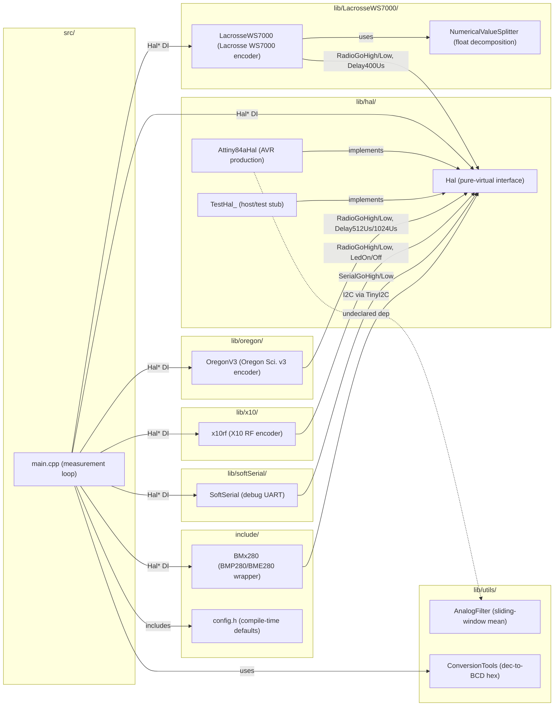

# Architecture Analysis — 2026-06-18

_Generated by rbd:arch-analyst as input for requirements reverse-engineering._

## Summary

- **Components identified:** 10 (`main.cpp`, `Hal`, `Attiny84aHal`, `TestHal_`, `OregonV3`, `LacrosseWS7000` + `NumericalValueSplitter`, `x10rf`, `SoftSerial`, `AnalogFilter`, `BMx280`, `ConversionTools`)
- **Requirement files status:** all six `requirements/*.md` files are empty templates — zero validated requirements exist
- **Candidate requirements identified:** 68 across 8 domains
- **Architectural violations:** 4 (see section below)

---

## Global Component Diagram

---

## Architectural Violations (must resolve before formalising requirements)

| # | Component | Violation | Location |
|---|-----------|-----------|----------|
| V1 | `x10rf` | Bypasses HAL for all timing on AVR — direct `_delay_us` calls for 9 ms preamble, 4.5 ms gap, 560 µs/1120 µs bit periods, 40 ms cooldown | `lib/x10/x10rf.cpp:44-67` |
| V2 | `Attiny84aHal` | Undeclared dependency on `AnalogFilter` (include at line 2, used in `AdcRead`) | `lib/hal/Attiny84aHal.cpp:2` |
| V3 | `main.cpp` | `BH1750` sensor component absent from `docs/architecture.md` | `src/main.cpp:24-25, 161-174` |
| V4 | `main.cpp` | `ds18b20` 1-Wire component absent from `docs/architecture.md` | `src/main.cpp:29-32, 119-130` |

---

## Requirements Reverse-Engineering Map

### FUNC-OREGON — Oregon Scientific v3 encoding

| Proposed ID | Short description | Source | Tested? |
|-------------|-------------------|--------|---------|
| FUNC-OREGON-001 | Zero bit → H-D512-L-D1024-H-D512 HAL sequence | `Oregon_v3.cpp:97-104` | Yes — `Expect_good_hardware_orders_for_zero` |
| FUNC-OREGON-002 | One bit → L-D512-H-D1024-L-D512 HAL sequence | `Oregon_v3.cpp:120-127` | Yes — `Expect_good_hardware_orders_for_one` |
| FUNC-OREGON-003 | Data bytes sent LSB-nibble first then MSB-nibble | `Oregon_v3.cpp:82-87` | Yes — `Expect_nibbles_to_be_sent_lsb_first` |
| FUNC-OREGON-004 | Frame begins with 24 one-bits (3×0xFF preamble) and ends with 2 zero-nibble postamble | `Oregon_v3.cpp:200-213` | Yes — `Expect_messages_to_have_preamble_and_postamble` |
| FUNC-OREGON-005 | Positive temperature encoded as decimal/unit/dozen in nibbles 8-11 | `Oregon_v3.cpp:138-165` | Yes — `Expect_right_positive_temperature_encoding` |
| FUNC-OREGON-006 | Negative temperature: bit 3 of nibble 9 set, absolute value encoded | `Oregon_v3.cpp:141-143` | Yes — `Expect_right_negative_temperature_encoding` |
| FUNC-OREGON-007 | Humidity (0-99 %) in nibbles 12-13 with tens/units swapped | `Oregon_v3.cpp:129-136` | Yes — `Expect_right_humidity_encoding` |
| FUNC-OREGON-008 | Pressure (850-1099 hPa, offset -795) in nibbles 14-17; weather-prediction byte at nibble 18 | `Oregon_v3.cpp:35-57` | Yes — `Expect_right_pressure_encoding` |
| FUNC-OREGON-009 | Channel (1-3) in nibble 4 as `1 << (channel-1)`; out-of-range ignored | `Oregon_v3.cpp:106-110` | Yes — `Expect_right_channel_encoding` |
| FUNC-OREGON-010 | Rolling code (≤ 0xA5) encoded in nibbles 5-6 | `Oregon_v3.cpp:115-118` | Yes — `Expect_right_rolling_code_encoding` |
| FUNC-OREGON-011 | Battery-low flag is bit 2 of nibble 7 | `Oregon_v3.cpp:27-33` | Yes — `Expect_right_battery_ok_encoding`, `Expect_right_low_battery_encoding` |
| FUNC-OREGON-012 | Device ID auto-selected at Send(): THN132N (0xEC40) temp-only, THGN123N (0x1D20) temp+humi, BTHR918 (0x5A5D) all | `Oregon_v3.cpp:167-199` | Yes — three sensor-type tests |
| FUNC-OREGON-013 | `messageStatus` bit-field tracks which fields are set (bit0=temp, bit1=humi, bit2=press) | `Oregon_v3.h:91` | Yes — `Expect_*_set_to_change_message_status` |
| FUNC-OREGON-014 | Full frame matches Oregon Scientific reference decoding samples | `Oregon_v3.cpp` | Yes — `Expect_sample_message_to_be_well_encoded`, `Expect_implementation_follows_samples_1/2` |

### FUNC-LACROSSE — Lacrosse WS7000 encoding

| Proposed ID | Short description | Source | Tested? |
|-------------|-------------------|--------|---------|
| FUNC-LACROSSE-001 | Preamble is exactly 10 consecutive zero bits | `LacrosseWS7000.cpp:75-79` | Yes — `Expect_preamble_is_10_times_0` |
| FUNC-LACROSSE-002 | Type nibble: 0=temp, 1=T+H, 4=T+H+P, 5=lux, F=error | `LacrosseWS7000.cpp:81-93` | Yes — `Expect_good_sensor_type_emission` |
| FUNC-LACROSSE-003 | Address (0-7) in bits 0-2 of second nibble; temperature sign in bit 3 | `LacrosseWS7000.cpp:95-102` | Yes — `Expect_good_sensor_address_emission` |
| FUNC-LACROSSE-004 | Temperature clamped ±99 °C; encoded as decimal/unit/dozen nibbles | `LacrosseWS7000.cpp:42-49, 104-111` | Yes — `Expect_good_temperature_emission` |
| FUNC-LACROSSE-005 | Humidity clamped 0-99.9 %; encoded as decimal/unit/dozen nibbles | `LacrosseWS7000.cpp:20-25, 131-138` | Yes — `Expect_good_humidity_emission` |
| FUNC-LACROSSE-006 | Pressure clamped 850-1100 hPa, offset -200; four nibbles: units/dozens/hundreds/decimal | `LacrosseWS7000.cpp:27-35, 140-148` | Yes — `Expect_good_pressure_emission` |
| FUNC-LACROSSE-007 | Luminosity (lux) as 7 nibbles in type-5 (light sensor) frame | `LacrosseWS7000.cpp:113-129` | Yes — `Expect_encoding_of_simple_luminosity_message` |
| FUNC-LACROSSE-008 | Frame ends with XOR checksum nibble and running-sum nibble (init 5) over all transmitted nibbles | `LacrosseWS7000.cpp:158-196` | Yes — all frame-level tests |
| FUNC-LACROSSE-009 | Each nibble followed by mandatory trailing one-bit separator | `LacrosseWS7000.cpp:67-73` | Yes — implicit in all frame tests |

### FUNC-X10 — X10 RF encoding

| Proposed ID | Short description | Source | Tested? |
|-------------|-------------------|--------|---------|
| FUNC-X10-001 | `RFXmeter`: 6-byte frame; address, complement, 24-bit BCD value, type nibble, parity nibble | `x10rf.cpp:121-215` | Yes — `Expect_x10_meter_right_encoding` |
| FUNC-X10-002 | `RFXsensor`: 4-byte frame; address, type, value, parity | `x10rf.cpp:217-259` | Yes — `Expect_x10_sensor_right_encoding` |
| FUNC-X10-003 | `x10Switch`: 4-byte frame with house-code nibble lookup, unit bit encoding, complement bytes | `x10rf.cpp:261-293` | Yes — `Expect_x10_switch_right_encoding` |
| FUNC-X10-004 | `x10Security`: 6-byte frame with XOR-fold parity over all bytes | `x10rf.cpp:295-322` | Yes — `Expect_x10_security_right_parity` |
| FUNC-X10-005 | Each transmission repeated `rf_repeats` times with 40 ms inter-repeat cooldown | `x10rf.cpp:69-90` | No — cooldown AVR-only, no-op in tests |
| FUNC-X10-006 | Battery voltage (mV, BCD via `dec16ToHex`) transmitted via `RFXmeter(BATTERY_VOLTAGE_X10_ID)`; suppressed when `lowBattery` | `main.cpp:132-146` | No |
| FUNC-X10-007 | Auxiliary analog voltage (mV, BCD) via `RFXmeter(ANALOG1_X10_ID)`; suppressed when `lowBattery` | `main.cpp:149-159` | No |

### FUNC-SENSOR — Sensor reading

| Proposed ID | Short description | Source | Tested? |
|-------------|-------------------|--------|---------|
| FUNC-SENSOR-001 | `BMx280` wraps BMP280/BME280 behind Begin/GetTemperature/GetPressure/GetHumidity/Shutdown at I2C 0x76 | `include/BMx280.h` | No — AVR-only |
| FUNC-SENSOR-002 | DS18B20 read via `ds18b20convert` + `ds18b20read` on PA3; raw/16 = °C | `main.cpp:119-130` | No |
| FUNC-SENSOR-003 | BH1750 read in ONE_TIME_HIGH_RES_MODE at I2C 0x23; reported as Lacrosse type-5 luminosity frame | `main.cpp:161-174` | No |

### FUNC-BATTERY — Battery measurement

| Proposed ID | Short description | Source | Tested? |
|-------------|-------------------|--------|---------|
| FUNC-BATTERY-001 | VCC derived from 1.1 V internal ref: `vccMv = INTERNAL_1v1 * (1024 / rawInternal11Ref)` | `Hal.h:32-37` | Yes — `test_power` |
| FUNC-BATTERY-002 | Battery voltage = VCC directly (`BATTERY_IS_VCC`) or PA1 resistor divider via `ConvertAnalogValueToMv` | `main.cpp:133-139`, `Hal.h:39-42` | Yes — `test_power` |
| FUNC-BATTERY-003 | When battery < `LOW_BATTERY_VOLTAGE`: `lowBattery=true`, Oregon frames get `SetBatteryLow(true)`, X10 meter frames suppressed | `main.cpp:140-146` | Partial — bit encoding tested; suppression not |

### FUNC-ANALOG — Analog sensor

| Proposed ID | Short description | Source | Tested? |
|-------------|-------------------|--------|---------|
| FUNC-ANALOG-001 | PA0 analog value read via `GetRawAnalogSensor()` and converted to mV using `ConvertAnalogValueToMv(rawAdc, vccMv)` | `main.cpp:151-157`, `Attiny84aHal.cpp:212-214` | No |

### TECH-HAL — HAL abstraction

| Proposed ID | Short description | Source | Tested? |
|-------------|-------------------|--------|---------|
| TECH-HAL-001 | All encoders and sensor wrappers receive `Hal*` at construction; never access AVR registers directly | `Hal.h`, all encoder constructors | Implicit — all unit tests inject `&TestHal` |
| TECH-HAL-002 | `TestHal_` records calls as char tokens in `Orders`: H/L=Radio, D=Delay512Us, P=Delay1024Us, A=Delay400Us, S/W=Serial | `TestHal.h:41-53` | Yes — all protocol suites |
| TECH-HAL-003 | `Hal::ComputeVccMv` and `Hal::ConvertAnalogValueToMv` are non-virtual concrete methods shared by both HAL implementations | `Hal.h:32-42` | Yes — `test_power` |
| TECH-HAL-004 | `Attiny84aHal` constructor disables Timer1, ADC, analog comparator; sets pull-ups on unused pins; disables BOD during sleep | `Attiny84aHal.cpp:35-63` | No |
| TECH-HAL-005 | LED state: `LedOn`/`LedOff` toggle PORTB PB1 on AVR; toggle `IsLedOn` boolean in TestHal | `Attiny84aHal.cpp:141-147`, `TestHal.h:55-56` | Yes — `test_led` |
| TECH-HAL-006 | `Hal::Init()` initialises I2C bus (TinyI2C.init() on AVR; sets `I2CIsConfigured=true` in TestHal) | `Attiny84aHal.h:52-56`, `TestHal.h:69` | Yes — `test_busses` |

### TECH-SERIAL — SoftSerial debug output

| Proposed ID | Short description | Source | Tested? |
|-------------|-------------------|--------|---------|
| TECH-SERIAL-001 | `SoftSerial` 9600-baud output-only UART using `SerialGoHigh/Low` with bit period `(1000000/9600) - 25` µs | `SoftSerial.cpp:6` | No |
| TECH-SERIAL-002 | Debug logging compiled only when `USE_SERIAL_LOG` defined; otherwise `SerialPrintInfo` is no-op inline | `main.cpp:69-83` | No |

### TECH-FILTER — Analog filtering

| Proposed ID | Short description | Source | Tested? |
|-------------|-------------------|--------|---------|
| TECH-FILTER-001 | `AnalogFilter` discards first `exclusion` values pushed, accumulates up to `samples`, returns integer mean | `AnalogFilter.cpp` | Yes — `test_analogFiltering` (6 cases) |
| TECH-FILTER-002 | `AnalogFilter` silently ignores values pushed after `samples` count is reached | `AnalogFilter.cpp:4-11` | Yes — `Expect_filter_to_ignore_supernumerary_values` |

### TECH-CONVERT — Numerical conversion

| Proposed ID | Short description | Source | Tested? |
|-------------|-------------------|--------|---------|
| TECH-CONVERT-001 | `dec16ToHex`: decimal integer → BCD hex (e.g. 4200 → 0x4200); max 9999, overflow on higher values | `conversionTools.cpp:5-22` | Yes — `Test_dec16ToHex` |
| TECH-CONVERT-002 | `dec32ToHex`: decimal integer → 32-bit BCD hex; max 99 999 999, overflow on higher values | `conversionTools.cpp:24-42` | Yes — `Test_dec32ToHex` |

### CONF-BUILD — Build-time configuration

| Proposed ID | Short description | Source | Tested? |
|-------------|-------------------|--------|---------|
| CONF-BUILD-001 | Exactly one of `USE_OREGON` or `USE_LACROSSE` must be defined per environment | `main.cpp:36-40`, `platformio.ini` | No |
| CONF-BUILD-002 | Sensor type selected via `USE_BMP280`, `USE_BME280`, `USE_DS18B20`, or `USE_BH1750`; `USE_I2C` auto-derived | `main.cpp:23-34`, `config.h:30-33` | No |
| CONF-BUILD-003 | Oregon channel (1-3) and rolling code (≤ 0xA5) set via `OREGON_CHANNEL` and `OREGON_RCODE` | `main.cpp:96-98`, `platformio.ini` S_02/S_04 | No |
| CONF-BUILD-004 | Lacrosse address set via `LACROSSE_ID` as `LacrosseWS7000::Address` enum value | `main.cpp:94-95`, `platformio.ini` S_03/robot/devmodule/SOLAR_TEST | No |
| CONF-BUILD-005 | `INTERNAL_1v1` must be individually calibrated per board (ATtiny84a chip-to-chip variation) | `platformio.ini` all AVR envs, `Hal.h:32-36` | No |
| CONF-BUILD-006 | `SLEEP_TIME_IN_SECONDS` sets hibernate interval; default 32 s | `config.h:22-24` | No |
| CONF-BUILD-007 | `LOW_BATTERY_VOLTAGE` (mV) set per environment to match battery chemistry; default 2000 mV | `config.h:26-28` | No |
| CONF-BUILD-008 | `BATTERY_VOLTAGE_X10_ID` assigns board-unique X10 meter address for battery voltage reporting | `main.cpp:55`, `platformio.ini` | No |
| CONF-BUILD-009 | `ANALOG1_X10_ID` optionally assigns board-unique X10 meter address for auxiliary analog reporting | `main.cpp:149`, `platformio.ini` SOLAR_TEST | No |
| CONF-BUILD-010 | `BATTERY_IS_VCC` signals VCC used directly as battery voltage (no resistor divider) | `main.cpp:134-135`, `platformio.ini` devmodule | No |
| CONF-BUILD-011 | `USE_CHARGE_PUMP` documents charge-pump sensor VCC rail (informational flag, not branched on in code) | `platformio.ini` S_02/S_03 | No |

### PLAT-POWER — Power management

| Proposed ID | Short description | Source | Tested? |
|-------------|-------------------|--------|---------|
| PLAT-POWER-001 | MCU hibernates in `SLEEP_MODE_PWR_DOWN` driven by 8 s WDT; `Hibernate(s)` loops `s/8` WDT periods | `Attiny84aHal.cpp:72-113, 221-223` | No |
| PLAT-POWER-002 | Sensor power rail (PA2) asserted before measurement, de-asserted after all transmissions | `Attiny84aHal.cpp:133-138`, `main.cpp:102, 201` | No |
| PLAT-POWER-003 | During sleep: all pins become inputs with pull-ups; PRR bits for USI/Timer0/Timer1/ADC set; state restored on wake | `Attiny84aHal.cpp:83-113` | No |
| PLAT-POWER-004 | Each frame transmission flanked by `LedOn` before and `LedOff + Delay30ms` after (`TRANSMIT_WITH_LED` macro) | `main.cpp:61-67` | Partial — `test_led` tests LedOn/Off in isolation |
| PLAT-POWER-005 | Target MCU is ATtiny84a at 1 MHz; all HAL delay methods calibrated to this clock frequency | `platformio.ini:board_build.f_cpu=1000000L`, `Attiny84aHal.cpp` | No |

---

## Key Observations for Next Session

1. **68 candidate requirements** — none yet committed to `requirements/*.md`.
2. **Richest tested domains:** FUNC-OREGON (14 req, all tested), FUNC-LACROSSE (9 req, most tested), TECH-FILTER (2, tested), TECH-CONVERT (2, tested). Start there.
3. **Domains with zero test coverage:** FUNC-SENSOR, TECH-SERIAL, CONF-BUILD, most of PLAT-POWER. Needs req + tests before any code changes.
4. **4 architectural violations (V1-V4 above) should be addressed as TECH requirements** before new code is written. V1 (`x10rf` bypasses HAL) is the highest-priority because it contradicts the declared DI contract.
5. **Suggested dispatch order for requirement-analyst agents:**
   - Batch 1 (parallel): FUNC-OREGON, FUNC-LACROSSE (well-defined, well-tested)
   - Batch 2 (parallel): FUNC-X10, TECH-HAL, TECH-FILTER, TECH-CONVERT
   - Batch 3 (parallel): FUNC-BATTERY, FUNC-SENSOR, FUNC-ANALOG, TECH-SERIAL
   - Batch 4 (parallel): CONF-BUILD, PLAT-POWER
   - After all req committed: update `docs/architecture.md` to resolve V1-V4
6. **Commit format reminder:** `req(FUNC-OREGON-001): <title>` per requirement; `arch(FUNC-OREGON-001): <description>` for architecture updates.
