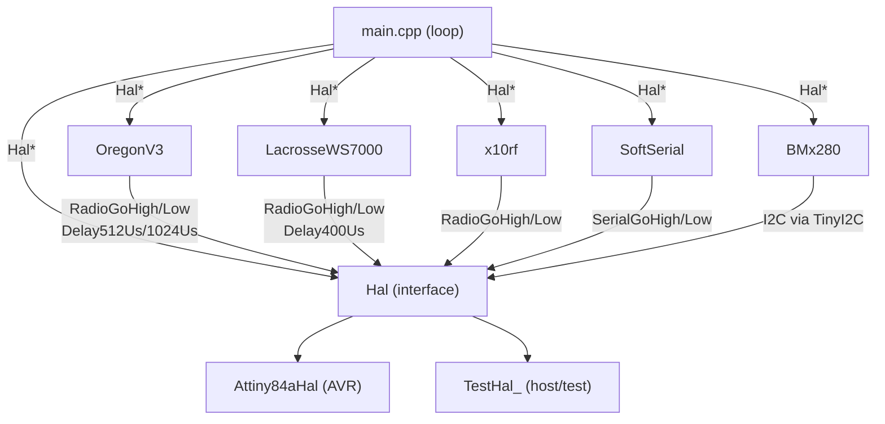

# Architecture

_Last updated: 2026-06-19 — requirements: TECH-SERIAL-001..002_

## Component Diagram

## Component Responsibilities

| Component | Responsibility | Requirement(s) |
|-----------|----------------|----------------|
| `Hal` | Pure-virtual interface isolating all hardware I/O | — |
| `Attiny84aHal` | ATtiny84a production implementation of Hal | — |
| `TestHal_` | Host-native stub; records HAL calls as char tokens in `Orders` vector | — |
| `OregonV3` | Encodes temperature/humidity/pressure into Oregon Scientific v3 frames | — |
| `LacrosseWS7000` | Encodes temperature/humidity/pressure/luminosity into Lacrosse WS7000 frames | — |
| `x10rf` | Encodes meter readings into X10 RF frames (battery voltage, analog sensors) | — |
| `BMx280` | Abstracts BMP280/BME280 I2C sensor behind a common interface | — |
| `SoftSerial` | Software UART for debug logging (optional, `USE_SERIAL_LOG`) | — |
| `main.cpp` | Measurement loop: power on → read sensors → encode → transmit → hibernate | — |
| `AnalogFilter` | Accumulates ADC samples with configurable warm-up exclusion; returns integer floor mean | TECH-FILTER-001, TECH-FILTER-002 |
| `ConversionTools` | BCD-in-hex conversion utilities for 16-bit and 32-bit decimal values | TECH-CONVERT-001, TECH-CONVERT-002 |

## Dependency Injection Map

| Component | Receives | Via |
|-----------|----------|-----|
| `OregonV3` | `Hal*` | constructor |
| `LacrosseWS7000` | `Hal*` | constructor |
| `x10rf` | `Hal*` | constructor |
| `BMx280` | `Hal*` | constructor |
| `SoftSerial` | `Hal*` | constructor |

All protocol encoders and sensor wrappers receive `Hal*` at construction. They must never access AVR registers directly.

## Build-time Configuration

Every physical board is a separate PlatformIO environment with its own `build_flags`. There is no runtime configuration. See `docs/environments.md` for the full table.

## Requirement → Component Traceability

| Requirement | Component(s) | Notes |
|-------------|-------------|-------|
| FUNC-OREGON-001 | `OregonV3` | Zero bit HAL call sequence (H-D512-L-D1024-H-D512) |
| FUNC-OREGON-002 | `OregonV3` | One bit HAL call sequence (L-D512-H-D1024-L-D512) |
| FUNC-OREGON-003 | `OregonV3` | Byte serialisation: LSB nibble before MSB nibble |
| FUNC-OREGON-004 | `OregonV3` | Frame structure: 3-byte preamble + payload + 1-byte postamble |
| FUNC-OREGON-005 | `OregonV3` | Positive temperature encoding in bytes 4–5 |
| FUNC-OREGON-006 | `OregonV3` | Negative temperature sign flag in byte 5 |
| FUNC-OREGON-007 | `OregonV3` | Humidity encoding with swapped nibbles in byte 6 |
| FUNC-OREGON-008 | `OregonV3` | Pressure encoding with 795 hPa offset; weather prediction in byte 9 |
| FUNC-OREGON-009 | `OregonV3` | Channel 1–3 encoded as bitmask in byte 2; out-of-range ignored |
| FUNC-OREGON-010 | `OregonV3` | Rolling code stored in low nibble of byte 2 and high nibble of byte 3 |
| FUNC-OREGON-011 | `OregonV3` | Battery-low flag is bit 2 of byte 3 |
| FUNC-OREGON-012 | `OregonV3` | Device ID auto-selected by FinalizeMessage() based on messageStatus |
| FUNC-OREGON-013 | `OregonV3` | messageStatus bit-field (bit0=temp, bit1=humi, bit2=press) |
| FUNC-OREGON-014 | `OregonV3` | Full frame matches Oregon Scientific v3 reference decoding samples |
| FUNC-LACROSSE-001 | `LacrosseWS7000` | Preamble is exactly 10 consecutive zero bits |
| FUNC-LACROSSE-002 | `LacrosseWS7000` | Sensor-type nibble encoding: 0=temp, 1=T+H, 4=T+H+P, 5=lux, F=unknown |
| FUNC-LACROSSE-003 | `LacrosseWS7000` | Address (0–7) in bits 0–2; negative temperature sign in bit 3 of second nibble |
| FUNC-LACROSSE-004 | `LacrosseWS7000` | Temperature clamped ±99 °C; encoded as decimal/unit/dozen nibbles |
| FUNC-LACROSSE-005 | `LacrosseWS7000` | Humidity clamped to 99.9 %; encoded as decimal/unit/dozen nibbles |
| FUNC-LACROSSE-006 | `LacrosseWS7000` | Pressure clamped 850–1100 hPa, offset −200; encoded as four nibbles |
| FUNC-LACROSSE-007 | `LacrosseWS7000` | Luminosity encoded as 7 nibbles in type-5 (light sensor) frame |
| FUNC-LACROSSE-008 | `LacrosseWS7000` | Frame ends with XOR checksum nibble and running-sum nibble (init 5) |
| FUNC-LACROSSE-009 | `LacrosseWS7000` | Each nibble followed by mandatory trailing one-bit separator |
| FUNC-X10-001 | `x10rf` | RFXmeter 6-byte frame: address, partial complement, 24-bit value, packet-type nibble, nibble-sum parity |
| FUNC-X10-002 | `x10rf` | RFXsensor 4-byte frame: address+type bits, partial complement, value, packet-type status + nibble-sum parity |
| FUNC-X10-003 | `x10rf` | x10Switch 4-byte frame: house-code nibble lookup, bit-scattered unit code, full-byte complements |
| FUNC-X10-004 | `x10rf` | x10Security 6-byte frame: address, swapped-nibble complement, command + complement, id, XOR-fold parity |
| FUNC-X10-005 | `x10rf` | Transmission repeated rf_repeats times with 40 ms AVR-only inter-repeat cooldown |
| FUNC-X10-006 | `main.cpp` | Battery voltage BCD-encoded and transmitted via RFXmeter; suppressed when lowBattery |
| FUNC-X10-007 | `main.cpp` | Analog sensor voltage BCD-encoded and transmitted via RFXmeter; suppressed when lowBattery |
| TECH-HAL-001 | `Hal` / `Attiny84aHal` / `TestHal_` | Encoders and wrappers take Hal* at construction; no direct AVR register access |
| TECH-HAL-002 | `TestHal_` | Orders vector char-token recording: H, L, D, P, A, S, W |
| TECH-HAL-003 | `Hal` | ComputeVccMv and ConvertAnalogValueToMv are non-virtual concrete methods on Hal base |
| TECH-HAL-004 | `Attiny84aHal` | Constructor power-reduction: disables Timer1, ADC, analog comparator; pull-ups unused pins; BOD-sleep disable |
| TECH-HAL-005 | `Attiny84aHal` / `TestHal_` | LedOn/LedOff toggle PORTB PB1 on AVR; toggle IsLedOn in TestHal_ |
| TECH-HAL-006 | `Attiny84aHal` / `TestHal_` | Init() calls TinyI2C.init() on AVR (USE_I2C); sets I2CIsConfigured in TestHal_ |
| TECH-FILTER-001 | `AnalogFilter` | Discards first `exclusion` values; accumulates up to `samples`; Get() returns integer floor mean |
| TECH-FILTER-002 | `AnalogFilter` | Push() after samples count reached is silently ignored; Get() returns mean of first samples values |
| TECH-CONVERT-001 | `ConversionTools` | dec16ToHex packs each decimal digit of uint16_t into one nibble (BCD-in-hex) |
| TECH-CONVERT-002 | `ConversionTools` | dec32ToHex packs each decimal digit of uint32_t into one nibble (BCD-in-hex) |
| TECH-SERIAL-001 | `SoftSerial` | Output-only UART at 9600 baud; bit period = (1 000 000 / 9600) − 25 µs; driven by SerialGoHigh/Low |
| TECH-SERIAL-002 | `main.cpp` | SoftSerial instantiated and SerialPrintInfo active only when USE_SERIAL_LOG defined; otherwise no-op |
