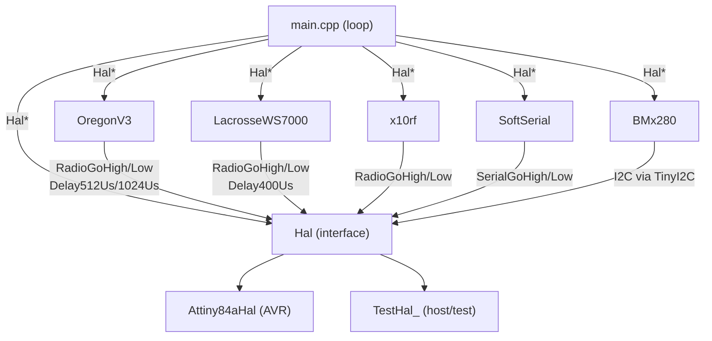

# Architecture

_Last updated: 2026-06-18 — initial capture_

## Component Diagram

## Component Responsibilities

| Component | Responsibility | Requirement(s) |
|-----------|----------------|----------------|
| `Hal` | Pure-virtual interface isolating all hardware I/O | — |
| `Attiny84aHal` | ATtiny84a production implementation of Hal | — |
| `TestHal_` | Host-native stub; records HAL calls as char tokens in `Orders` vector | — |
| `OregonV3` | Encodes temperature/humidity/pressure into Oregon Scientific v3 frames | — |
| `LacrosseWS7000` | Encodes temperature/humidity/pressure/luminosity into Lacrosse WS7000 frames | — |
| `x10rf` | Encodes meter readings into X10 RF frames (battery voltage, analog sensors) | — |
| `BMx280` | Abstracts BMP280/BME280 I2C sensor behind a common interface | — |
| `SoftSerial` | Software UART for debug logging (optional, `USE_SERIAL_LOG`) | — |
| `main.cpp` | Measurement loop: power on → read sensors → encode → transmit → hibernate | — |

## Dependency Injection Map

| Component | Receives | Via |
|-----------|----------|-----|
| `OregonV3` | `Hal*` | constructor |
| `LacrosseWS7000` | `Hal*` | constructor |
| `x10rf` | `Hal*` | constructor |
| `BMx280` | `Hal*` | constructor |
| `SoftSerial` | `Hal*` | constructor |

All protocol encoders and sensor wrappers receive `Hal*` at construction. They must never access AVR registers directly.

## Build-time Configuration

Every physical board is a separate PlatformIO environment with its own `build_flags`. There is no runtime configuration. See `docs/environments.md` for the full table.

## Requirement → Component Traceability

| Requirement | Component(s) | Notes |
|-------------|-------------|-------|
| — | — | Populated as requirements are added |
