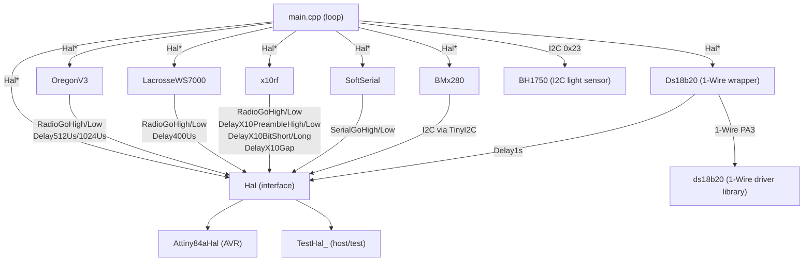

# Architecture

_Last updated: 2026-06-19 — requirements: TECH-SENSOR-001_

## Component Diagram

## Component Responsibilities

| Component | Responsibility | Requirement(s) |
|-----------|----------------|----------------|
| `Hal` | Pure-virtual interface isolating all hardware I/O | — |
| `Attiny84aHal` | ATtiny84a production implementation of Hal | — |
| `TestHal_` | Host-native stub; records HAL calls as char tokens in `Orders` vector | — |
| `OregonV3` | Encodes temperature/humidity/pressure into Oregon Scientific v3 frames | — |
| `LacrosseWS7000` | Encodes temperature/humidity/pressure/luminosity into Lacrosse WS7000 frames | — |
| `x10rf` | Encodes meter readings into X10 RF frames (battery voltage, analog sensors); routes all timing through Hal X10 delay methods | TECH-X10-001, TECH-X10-002 |
| `BMx280` | Abstracts BMP280/BME280 I2C sensor behind a common interface | — |
| `Ds18b20` | Wrapper class encapsulating DS18B20 1-Wire access; accepts `Hal*` at construction; exposes `Begin()`, `Convert()`, `Read()`; uses `hal->Delay1s()` between convert and read on AVR; stubs on non-AVR | TECH-SENSOR-001 |
| `SoftSerial` | Software UART for debug logging (optional, `USE_SERIAL_LOG`) | — |
| `ds18b20` | 1-Wire driver library on PA3; called only through `Ds18b20` wrapper | FUNC-SENSOR-002 |
| `BH1750` | I2C light sensor at 0x23; ONE_TIME_HIGH_RES_MODE; result in lux | FUNC-SENSOR-003 |
| `main.cpp` | Measurement loop: power on → read sensors → encode → transmit → hibernate | — |
| `AnalogFilter` | Accumulates ADC samples with configurable warm-up exclusion; returns integer floor mean | TECH-FILTER-001, TECH-FILTER-002 |
| `ConversionTools` | BCD-in-hex conversion utilities for 16-bit and 32-bit decimal values | TECH-CONVERT-001, TECH-CONVERT-002 |

## Dependency Injection Map

| Component | Receives | Via |
|-----------|----------|-----|
| `OregonV3` | `Hal*` | constructor |
| `LacrosseWS7000` | `Hal*` | constructor |
| `x10rf` | `Hal*` | constructor |
| `BMx280` | `Hal*` | constructor |
| `Ds18b20` | `Hal*` | constructor |
| `SoftSerial` | `Hal*` | constructor |

All protocol encoders and sensor wrappers receive `Hal*` at construction. They must never access AVR registers directly.

## Build-time Configuration

Every physical board is a separate PlatformIO environment with its own `build_flags`. There is no runtime configuration. See `docs/environments.md` for the full table.

## Requirement → Component Traceability

| Requirement | Component(s) | Notes |
|-------------|-------------|-------|
| FUNC-OREGON-001 | `OregonV3` | Zero bit HAL call sequence (H-D512-L-D1024-H-D512) |
| FUNC-OREGON-002 | `OregonV3` | One bit HAL call sequence (L-D512-H-D1024-L-D512) |
| FUNC-OREGON-003 | `OregonV3` | Byte serialisation: LSB nibble before MSB nibble |
| FUNC-OREGON-004 | `OregonV3` | Frame structure: 3-byte preamble + payload + 1-byte postamble |
| FUNC-OREGON-005 | `OregonV3` | Positive temperature encoding in bytes 4–5 |
| FUNC-OREGON-006 | `OregonV3` | Negative temperature sign flag in byte 5 |
| FUNC-OREGON-007 | `OregonV3` | Humidity encoding with swapped nibbles in byte 6 |
| FUNC-OREGON-008 | `OregonV3` | Pressure encoding with 795 hPa offset; weather prediction in byte 9 |
| FUNC-OREGON-009 | `OregonV3` | Channel 1–3 encoded as bitmask in byte 2; out-of-range ignored |
| FUNC-OREGON-010 | `OregonV3` | Rolling code stored in low nibble of byte 2 and high nibble of byte 3 |
| FUNC-OREGON-011 | `OregonV3` | Battery-low flag is bit 2 of byte 3 |
| FUNC-OREGON-012 | `OregonV3` | Device ID auto-selected by FinalizeMessage() based on messageStatus |
| FUNC-OREGON-013 | `OregonV3` | messageStatus bit-field (bit0=temp, bit1=humi, bit2=press) |
| FUNC-OREGON-014 | `OregonV3` | Full frame matches Oregon Scientific v3 reference decoding samples |
| FUNC-LACROSSE-001 | `LacrosseWS7000` | Preamble is exactly 10 consecutive zero bits |
| FUNC-LACROSSE-002 | `LacrosseWS7000` | Sensor-type nibble encoding: 0=temp, 1=T+H, 4=T+H+P, 5=lux, F=unknown |
| FUNC-LACROSSE-003 | `LacrosseWS7000` | Address (0–7) in bits 0–2; negative temperature sign in bit 3 of second nibble |
| FUNC-LACROSSE-004 | `LacrosseWS7000` | Temperature clamped ±99 °C; encoded as decimal/unit/dozen nibbles |
| FUNC-LACROSSE-005 | `LacrosseWS7000` | Humidity clamped to 99.9 %; encoded as decimal/unit/dozen nibbles |
| FUNC-LACROSSE-006 | `LacrosseWS7000` | Pressure clamped 850–1100 hPa, offset −200; encoded as four nibbles |
| FUNC-LACROSSE-007 | `LacrosseWS7000` | Luminosity encoded as 7 nibbles in type-5 (light sensor) frame |
| FUNC-LACROSSE-008 | `LacrosseWS7000` | Frame ends with XOR checksum nibble and running-sum nibble (init 5) |
| FUNC-LACROSSE-009 | `LacrosseWS7000` | Each nibble followed by mandatory trailing one-bit separator |
| FUNC-X10-001 | `x10rf` | RFXmeter 6-byte frame: address, partial complement, 24-bit value, packet-type nibble, nibble-sum parity |
| FUNC-X10-002 | `x10rf` | RFXsensor 4-byte frame: address+type bits, partial complement, value, packet-type status + nibble-sum parity |
| FUNC-X10-003 | `x10rf` | x10Switch 4-byte frame: house-code nibble lookup, bit-scattered unit code, full-byte complements |
| FUNC-X10-004 | `x10rf` | x10Security 6-byte frame: address, swapped-nibble complement, command + complement, id, XOR-fold parity |
| FUNC-X10-005 | `x10rf` | Transmission repeated rf_repeats times with 40 ms inter-repeat cooldown via DelayX10Gap (see TECH-X10-001) |
| FUNC-X10-006 | `main.cpp` | Battery voltage BCD-encoded and transmitted via RFXmeter; suppressed when lowBattery |
| FUNC-X10-007 | `main.cpp` | Analog sensor voltage BCD-encoded and transmitted via RFXmeter; suppressed when lowBattery |
| TECH-HAL-001 | `Hal` / `Attiny84aHal` / `TestHal_` | Encoders and wrappers take Hal* at construction; no direct AVR register access |
| TECH-HAL-002 | `TestHal_` | Orders vector char-token recording: H, L, D, P, A, S, W |
| TECH-HAL-003 | `Hal` | ComputeVccMv and ConvertAnalogValueToMv are non-virtual concrete methods on Hal base |
| TECH-HAL-004 | `Attiny84aHal` | Constructor power-reduction: disables Timer1, ADC, analog comparator; pull-ups unused pins; BOD-sleep disable |
| TECH-HAL-005 | `Attiny84aHal` / `TestHal_` | LedOn/LedOff toggle PORTB PB1 on AVR; toggle IsLedOn in TestHal_ |
| TECH-HAL-006 | `Attiny84aHal` / `TestHal_` | Init() calls TinyI2C.init() on AVR (USE_I2C); sets I2CIsConfigured in TestHal_ |
| TECH-FILTER-001 | `AnalogFilter` | Discards first `exclusion` values; accumulates up to `samples`; Get() returns integer floor mean |
| TECH-FILTER-002 | `AnalogFilter` | Push() after samples count reached is silently ignored; Get() returns mean of first samples values |
| TECH-CONVERT-001 | `ConversionTools` | dec16ToHex packs each decimal digit of uint16_t into one nibble (BCD-in-hex) |
| TECH-CONVERT-002 | `ConversionTools` | dec32ToHex packs each decimal digit of uint32_t into one nibble (BCD-in-hex) |
| TECH-SERIAL-001 | `SoftSerial` | Output-only UART at 9600 baud; bit period = (1 000 000 / 9600) − 25 µs; driven by SerialGoHigh/Low |
| TECH-SERIAL-002 | `main.cpp` | SoftSerial instantiated and SerialPrintInfo active only when USE_SERIAL_LOG defined; otherwise no-op |
| TECH-X10-001 | `Hal` / `Attiny84aHal` / `TestHal_` | Five new pure-virtual Hal methods: DelayX10PreambleHigh (8960 µs), DelayX10PreambleLow (4500 µs), DelayX10BitShort (560 µs), DelayX10BitLong (1120 µs), DelayX10Gap (40000 µs) |
| TECH-X10-002 | `x10rf` | x10rf replaces all file-static _delay_us() calls with the five new Hal timing methods; <util/delay.h> block removed |
| FUNC-BATTERY-001 | `Hal` / `main.cpp` | ComputeVccMv reads internal 1.1 V ADC ref; calibrated constant supplied as INTERNAL_1v1 build flag |
| FUNC-BATTERY-002 | `Hal` / `main.cpp` | batteryVoltageInMv = vccMv (BATTERY_IS_VCC) or ConvertAnalogValueToMv(GetRawBattery(), vccMv) |
| FUNC-BATTERY-003 | `main.cpp` | lowBattery flag gates Oregon SetBatteryLow and suppresses all RFXmeter transmissions |
| FUNC-SENSOR-001 | `BMx280` | Wraps BMP280/BME280 at I2C 0x76; Begin/GetTemperature/GetPressure/GetHumidity/Shutdown interface |
| FUNC-SENSOR-002 | `Ds18b20` | ds18b20convert + ds18b20read on PA3; raw / 16 = temperature in °C; accessed only through Ds18b20 wrapper |
| TECH-SENSOR-001 | `Ds18b20` | DS18B20 access encapsulated in Ds18b20 wrapper; main.cpp must not reference PORTA/DDRA/PINA or ds18b20 library functions directly |
| FUNC-SENSOR-003 | `main.cpp` (BH1750) / `LacrosseWS7000` | BH1750 at I2C 0x23 ONE_TIME_HIGH_RES_MODE; lux reported as two Lacrosse type-5 frames |
| FUNC-ANALOG-001 | `Hal` / `main.cpp` | GetRawAnalogSensor() reads PA0; ConvertAnalogValueToMv converts to mV using vccMv from FUNC-BATTERY-001 |
| CONF-BUILD-001 | `main.cpp` / `platformio.ini` | Exactly one of USE_OREGON or USE_LACROSSE per environment; violated at compile time otherwise |
| CONF-BUILD-002 | `main.cpp` / `include/config.h` | Sensor type flag (USE_BMP280/BME280/DS18B20/BH1750) selects included driver; USE_I2C auto-derived |
| CONF-BUILD-003 | `main.cpp` / `platformio.ini` | OREGON_CHANNEL (1–3) and OREGON_RCODE (≤ 0xA5) applied to OregonV3 in main() |
| CONF-BUILD-004 | `main.cpp` / `platformio.ini` | LACROSSE_ID enum value applied to LacrosseWS7000 in main() |
| CONF-BUILD-005 | `Hal` / `platformio.ini` | INTERNAL_1v1 (mV) chip-calibrated constant consumed by Hal::ComputeVccMv() |
| CONF-BUILD-006 | `main.cpp` / `include/config.h` | SLEEP_TIME_IN_SECONDS passed to Hal::Hibernate(); default 32 s from config.h |
| CONF-BUILD-007 | `main.cpp` / `include/config.h` | LOW_BATTERY_VOLTAGE compared against batteryVoltageInMv; default 2000 mV from config.h |
| CONF-BUILD-008 | `main.cpp` / `platformio.ini` | BATTERY_VOLTAGE_X10_ID passed as address to x10rf::RFXmeter() for battery reporting |
| CONF-BUILD-009 | `main.cpp` / `platformio.ini` | ANALOG1_X10_ID optionally enables PA0 analog transmission via x10rf::RFXmeter() |
| CONF-BUILD-010 | `main.cpp` / `platformio.ini` | BATTERY_IS_VCC skips GetRawBattery(); batteryVoltageInMv = vccMv directly |
| CONF-BUILD-011 | `platformio.ini` | USE_CHARGE_PUMP is an informational flag only; no firmware branch depends on it |
| PLAT-POWER-001 | `Attiny84aHal` | Hibernate loops SLEEP_MODE_PWR_DOWN for ceil(s/8) WDT periods; minimum 1 period |
| PLAT-POWER-002 | `Attiny84aHal` / `main.cpp` | PA2 (SENSOR_VCC) driven high before first sensor read; driven low after last transmission |
| PLAT-POWER-003 | `Attiny84aHal` | PRR bits for USI/Timer0/Timer1/ADC set in sleep(); GPIO reconfigured as inputs with pull-ups; all restored on wake |
| PLAT-POWER-004 | `main.cpp` | TRANSMIT_WITH_LED macro wraps every Send(): LedOn() before, LedOff() + Delay30ms() after |
| PLAT-POWER-005 | `Attiny84aHal` / `platformio.ini` | ATtiny84a at F_CPU = 1 000 000 L; all HAL delay methods calibrated to this frequency |
