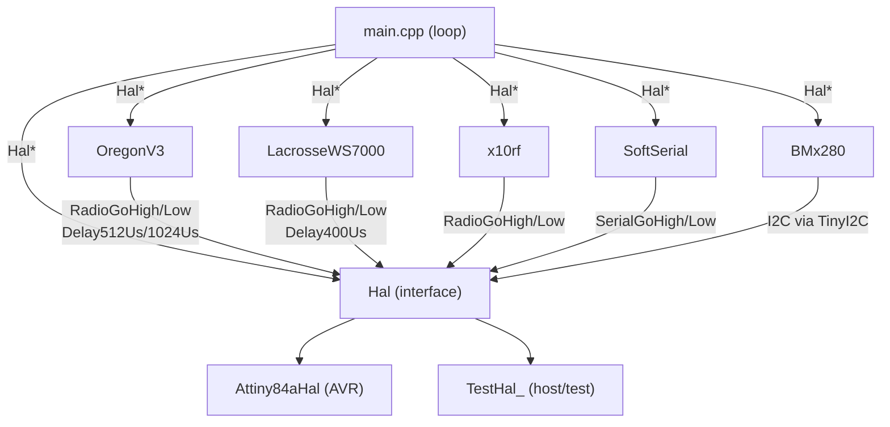

# Architecture

_Last updated: 2026-06-19 — requirements: FUNC-OREGON-001..014_

## Component Diagram

## Component Responsibilities

| Component | Responsibility | Requirement(s) |
|-----------|----------------|----------------|
| `Hal` | Pure-virtual interface isolating all hardware I/O | — |
| `Attiny84aHal` | ATtiny84a production implementation of Hal | — |
| `TestHal_` | Host-native stub; records HAL calls as char tokens in `Orders` vector | — |
| `OregonV3` | Encodes temperature/humidity/pressure into Oregon Scientific v3 frames | — |
| `LacrosseWS7000` | Encodes temperature/humidity/pressure/luminosity into Lacrosse WS7000 frames | — |
| `x10rf` | Encodes meter readings into X10 RF frames (battery voltage, analog sensors) | — |
| `BMx280` | Abstracts BMP280/BME280 I2C sensor behind a common interface | — |
| `SoftSerial` | Software UART for debug logging (optional, `USE_SERIAL_LOG`) | — |
| `main.cpp` | Measurement loop: power on → read sensors → encode → transmit → hibernate | — |

## Dependency Injection Map

| Component | Receives | Via |
|-----------|----------|-----|
| `OregonV3` | `Hal*` | constructor |
| `LacrosseWS7000` | `Hal*` | constructor |
| `x10rf` | `Hal*` | constructor |
| `BMx280` | `Hal*` | constructor |
| `SoftSerial` | `Hal*` | constructor |

All protocol encoders and sensor wrappers receive `Hal*` at construction. They must never access AVR registers directly.

## Build-time Configuration

Every physical board is a separate PlatformIO environment with its own `build_flags`. There is no runtime configuration. See `docs/environments.md` for the full table.

## Requirement → Component Traceability

| Requirement | Component(s) | Notes |
|-------------|-------------|-------|
| FUNC-OREGON-001 | `OregonV3` | Zero bit HAL call sequence (H-D512-L-D1024-H-D512) |
| FUNC-OREGON-002 | `OregonV3` | One bit HAL call sequence (L-D512-H-D1024-L-D512) |
| FUNC-OREGON-003 | `OregonV3` | Byte serialisation: LSB nibble before MSB nibble |
| FUNC-OREGON-004 | `OregonV3` | Frame structure: 3-byte preamble + payload + 1-byte postamble |
| FUNC-OREGON-005 | `OregonV3` | Positive temperature encoding in bytes 4–5 |
| FUNC-OREGON-006 | `OregonV3` | Negative temperature sign flag in byte 5 |
| FUNC-OREGON-007 | `OregonV3` | Humidity encoding with swapped nibbles in byte 6 |
| FUNC-OREGON-008 | `OregonV3` | Pressure encoding with 795 hPa offset; weather prediction in byte 9 |
| FUNC-OREGON-009 | `OregonV3` | Channel 1–3 encoded as bitmask in byte 2; out-of-range ignored |
| FUNC-OREGON-010 | `OregonV3` | Rolling code stored in low nibble of byte 2 and high nibble of byte 3 |
| FUNC-OREGON-011 | `OregonV3` | Battery-low flag is bit 2 of byte 3 |
| FUNC-OREGON-012 | `OregonV3` | Device ID auto-selected by FinalizeMessage() based on messageStatus |
| FUNC-OREGON-013 | `OregonV3` | messageStatus bit-field (bit0=temp, bit1=humi, bit2=press) |
| FUNC-OREGON-014 | `OregonV3` | Full frame matches Oregon Scientific v3 reference decoding samples |
