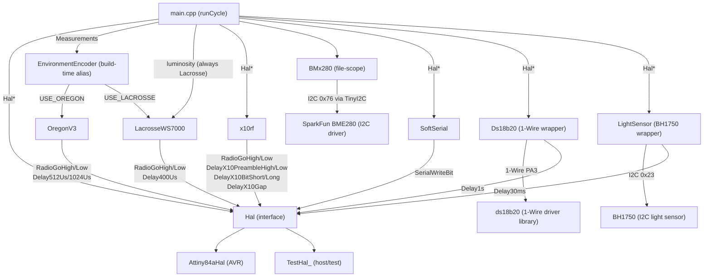
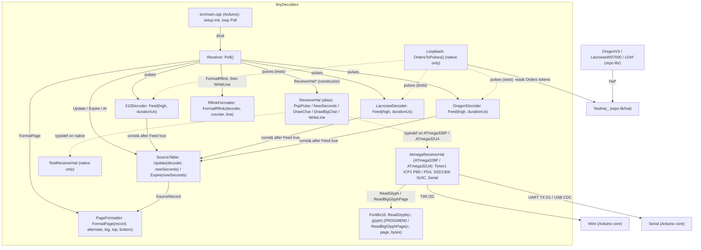

# Architecture

_Last updated: 2026-11-17 — [FUNC-X10-003](../requirements/functional.md#func-x10-003) (deprecated, x10Switch removed)_

Emitter firmware paths (`src/`, `include/`, `test/`, `platformio.ini`) are relative to `emitter/`; `lib/` is at the repository root, shared with `tinyDecoders/`.

## Component Diagram

```mermaid
graph TD
  main["main.cpp (runCycle)"] -->|Hal*| HAL
  main -->|"Measurements"| EnvEnc["EnvironmentEncoder (build-time alias)"]
  EnvEnc -->|"USE_OREGON"| OregonV3
  EnvEnc -->|"USE_LACROSSE"| LacrosseWS7000
  main -->|"luminosity (always Lacrosse)"| LacrosseWS7000
  main -->|Hal*| x10rf
  main --> BMx280["BMx280 (file-scope)"]
  main -->|Hal*| SoftSerial
  main -->|Hal*| Ds18b20["Ds18b20 (1-Wire wrapper)"]
  Ds18b20 -->|"1-Wire PA3"| ds18b20["ds18b20 (1-Wire driver library)"]
  main -->|Hal*| LightSensor["LightSensor (BH1750 wrapper)"]
  LightSensor -->|"I2C 0x23"| BH1750["BH1750 (I2C light sensor)"]
  LightSensor -->|Delay30ms| HAL

  HAL["Hal (interface)"] --> Attiny84aHal["Attiny84aHal (AVR)"]
  HAL --> TestHal["TestHal_ (host/test)"]

  OregonV3 -->|RadioGoHigh/Low\nDelay512Us/1024Us| HAL
  LacrosseWS7000 -->|RadioGoHigh/Low\nDelay400Us| HAL
  x10rf -->|"RadioGoHigh/Low\nDelayX10PreambleHigh/Low\nDelayX10BitShort/Long\nDelayX10Gap"| HAL
  SoftSerial -->|SerialWriteBit| HAL
  BMx280 -->|"I2C 0x76 via TinyI2C"| BME280["SparkFun BME280 (I2C driver)"]
  Ds18b20 -->|Delay1s| HAL
```

## Component Responsibilities

| Component | Responsibility | Requirement(s) |
|-----------|----------------|----------------|
| `Hal` | Pure-virtual interface isolating all hardware I/O | — |
| `Attiny84aHal` | ATtiny84a production implementation of Hal | — |
| `TestHal_` | Host-native stub; records HAL calls as char tokens in `Orders` vector | — |
| `OregonV3` | Encodes temperature/humidity/pressure into Oregon Scientific v2.1 frames (bit doubling, despite the class name) in the layout RFLink `Plugin_048.c` decodes: sync nibble in byte 0, IDs `EA4C`/`1A2D`/`5A5D`, rolling code byte 3, flags nibble 8, pressure byte 8 = hPa − 795 | — |
| `LacrosseWS7000` | Encodes temperature/humidity/pressure/luminosity into Lacrosse WS7000 frames | — |
| `x10rf` | Encodes meter readings into X10 RF frames (battery voltage, analog sensors); routes all timing through Hal X10 delay methods | [TECH-X10-001](../requirements/technical.md#tech-x10-001), [TECH-X10-002](../requirements/technical.md#tech-x10-002) |
| `BMx280` | Abstracts BMP280/BME280 I2C sensor behind a common interface; no `Hal*`, hardware access delegated to SparkFun BME280 over TinyI2C; file-scope object in `main.cpp` | [FUNC-SENSOR-001](../requirements/functional.md#func-sensor-001), [TECH-HAL-001](../requirements/technical.md#tech-hal-001) |
| `Ds18b20` | Wrapper class encapsulating DS18B20 1-Wire access; accepts `Hal*` at construction; exposes `Begin()`, `Convert()`, `Read()`; uses `hal->Delay1s()` between convert and read on AVR; stubs on non-AVR | [TECH-SENSOR-001](../requirements/technical.md#tech-sensor-001) |
| `SoftSerial` | Software UART for debug logging (optional, `USE_SERIAL_LOG`) | — |
| `ds18b20` | 1-Wire driver library on PA3; called only through `Ds18b20` wrapper | [FUNC-SENSOR-002](../requirements/functional.md#func-sensor-002) |
| `BH1750` | I2C light sensor at 0x23; ONE_TIME_HIGH_RES_MODE; result in lux; called only through `LightSensor` | [FUNC-SENSOR-003](../requirements/functional.md#func-sensor-003) |
| `LightSensor` | Wrapper for BH1750 (`include/LightSensor.h`); `Read()` starts a one-shot measurement, waits 150 ms through the HAL, returns lux; stub on non-AVR | [FUNC-SENSOR-003](../requirements/functional.md#func-sensor-003) |
| `Measurements` | Values of one cycle (`include/Measurements.h`): temperature, humidity, pressure, luminosity, each with a "present" flag | — |
| `EnvironmentEncoder` | Build-time alias to `OregonV3` or `LacrosseWS7000` (`include/EnvironmentEncoder.h`) + `ConfigureEncoder()` and `ApplyMeasurements()` overloads | [FUNC-OREGON-012](../requirements/functional.md#func-oregon-012), [FUNC-LACROSSE-002](../requirements/functional.md#func-lacrosse-002), [FUNC-BATTERY-003](../requirements/functional.md#func-battery-003) |
| `main.cpp` | `runCycle(Hal*)` (declared in `include/main.h`): one cycle, `hal->Init()` ([TECH-HAL-006](../requirements/technical.md#tech-hal-006)) → power on → read sensors → encode → transmit → power off → hibernate, with encoders and wrappers built from the injected `Hal*` (except the file-scope `BMx280`); `main()` (excluded under `UNIT_TEST`) = endless `runCycle(&hal)` loop | [TECH-MAIN-001](../requirements/technical.md#tech-main-001), [TECH-HAL-006](../requirements/technical.md#tech-hal-006), [FUNC-MAIN-001](../requirements/functional.md#func-main-001) |
| `AnalogFilter` | Accumulates ADC samples with configurable warm-up exclusion; returns integer floor mean | [TECH-FILTER-001](../requirements/technical.md#tech-filter-001), [TECH-FILTER-002](../requirements/technical.md#tech-filter-002) |
| `ConversionTools` | BCD-in-hex conversion utilities for 16-bit and 32-bit decimal values | [TECH-CONVERT-001](../requirements/technical.md#tech-convert-001), [TECH-CONVERT-002](../requirements/technical.md#tech-convert-002) |

## Dependency Injection Map

| Component | Receives | Via |
|-----------|----------|-----|
| `OregonV3` | `Hal*` | constructor |
| `LacrosseWS7000` | `Hal*` | constructor |
| `x10rf` | `Hal*` | constructor |
| `BMx280` | — (none) | — |
| `Ds18b20` | `Hal*` | constructor |
| `SoftSerial` | `Hal*` | constructor |
| `LightSensor` | `Hal*` | constructor |
| `runCycle` (`main.cpp`) | `Hal*` | function parameter; forwarded to every encoder and wrapper it constructs |
| `Receiver` (tinyDecoders) | `ReceiverHal*` (compile-time alias: `AtmegaReceiverHal` on ATmega328P and ATmega32U4, `TestReceiverHal` on native) | constructor |

Protocol encoders and sensor wrappers that use the HAL receive `Hal*` at construction; a wrapper whose bus access is delegated to a third-party driver (`BMx280`) receives none. None accesses AVR registers directly, except register addresses passed to a third-party bus driver (`Ds18b20`).

## Main loop structure

`src/main.cpp` only orchestrates; protocol and sensor details live in the encoders and wrappers. One cycle is `void runCycle(Hal* hal)` ([TECH-MAIN-001](../requirements/technical.md#tech-main-001), declared in `include/main.h`); `runCycle` starts with `hal->Init()` ([TECH-HAL-006](../requirements/technical.md#tech-hal-006)), `main()` only loops on `runCycle(&hal)`, and is compiled out under `UNIT_TEST` so native test binaries can link `src/`.

1. `hal->PowerOnSensors()`.
2. `ReadEnvironment()` fills a `Measurements` from the fitted sensors (`BMx280`, `Ds18b20`). A field is flagged present only if its sensor is fitted and read correctly (DS18B20: `0` means read error).
3. Battery and analog X10 meters (`BATTERY_VOLTAGE_X10_ID`, `ANALOG1_X10_ID`), suppressed when the battery is low. VCC is computed once when either is enabled.
4. Luminosity (`USE_BH1750`, battery not low): `LightSensor::Read()`, then a dedicated Lacrosse encoder sends a type-5 frame `LIGHT_FRAME_REPEAT` (2) times.
5. Environment frame (`USE_OREGON` / `USE_LACROSSE`): `ApplyMeasurements()` loads the present fields into the encoder and returns whether to send (only when a temperature is present). Oregon also gets the battery-low flag. The frame is sent twice, with the radio low between the two copies for at least one frame length: 246 ms for Oregon, 98 ms for Lacrosse ([FUNC-MAIN-001](../requirements/functional.md#func-main-001)).
6. `hal->PowerOffSensors()`, `hal->Hibernate(SLEEP_TIME_IN_SECONDS)`.

Design choices:

- **Static interface, no virtual call.** The protocol is fixed at build time, so `EnvironmentEncoder` is a `typedef` and `ApplyMeasurements()` an overload per encoder. On an ATtiny84a (8 KB flash) this avoids a vtable and indirect calls while keeping a single call site in `main.cpp`.
- **Luminosity always uses Lacrosse.** Oregon v3 has no light frame, and a Lacrosse frame carrying luminosity cannot carry other fields (`LacrosseWS7000::Send()` gives luminosity priority). Targets with `USE_BH1750` therefore need `LACROSSE_ID`, whatever the environment protocol.
- **Encoders and sensors are built inside `runCycle`** from the injected `Hal*` and configured (`ConfigureEncoder()`, `SetAddress()`) on every cycle; the low-battery flag and battery voltage are locals of the cycle. Exception: `BMx280` is a file-scope object, because built per cycle it costs ~288 B flash on `robot` (97.7 % vs 93.9 %): LTO can no longer resolve the SparkFun driver at a fixed address. It only holds the driver configuration, re-initialised by `Begin()` every cycle. Otherwise nothing persists between cycles, so a field absent in a cycle no longer keeps its previous value in the encoder; this is harmless because the environment frame is only sent when a temperature is present.
- **Native cycle tests.** `test_main_cycle` runs only in dedicated native envs that build `src/` (`test_build_src = yes`) with `SLEEP_TIME_IN_SECONDS=0` (`TestHal_::Hibernate` really sleeps); `native_debug` ignores it. One env per build variant family:

  | Env | Variant | Flags |
  |-----|---------|-------|
  | `native_cycle` (common base) | — | `NATIVE`, `UNIT_TEST`, `SLEEP_TIME_IN_SECONDS=0`, `INTERNAL_1v1`, `LOW_BATTERY_VOLTAGE`, `BATTERY_VOLTAGE_X10_ID` |
  | `native_cycle_oregon` | Oregon, divided battery | base + `USE_OREGON`, `USE_BMP280`, `ANALOG1_X10_ID` |
  | `native_cycle_oregon_vcc` | Oregon, battery = VCC | base + `USE_OREGON`, `USE_BME280`, `BATTERY_IS_VCC` |
  | `native_cycle_lacrosse` | Lacrosse | base + `USE_LACROSSE`, `USE_BMP280` |
  | `native_cycle_x10` | No environment protocol | base + `ANALOG1_X10_ID` |
  | `native_cycle_oregon_divider` | Oregon, battery divider, no pressure | base + `USE_OREGON`, `USE_BME280`, `OREGON_NO_PRESSURE`, `BATTERY_DIVIDER=2` |

  Protocol envs also set a sensor flag: the native `BMx280` stub returns 0, which still counts as a present temperature, so an environment frame is emitted.
- **Targets without a radio protocol** (`S_05`, `devmodule`) still read their environment sensor but only transmit X10 meters: this is intended (test modules).
- Equivalence with the former `main.cpp` is checked by `test_environment`, which compares the HAL orders produced through `ApplyMeasurements()` with direct encoder calls.

## tinyDecoders sub-project

`tinyDecoders/` (repository root) is a separate PlatformIO project: a 433 MHz receiver that decodes the frames tinySensors emit and shows them on an OLED; it also writes one RFLink line per frame on `Serial` (a debug UART on the Pro Mini, USB CDC on the Pro Micro). The production receiver is a standalone viewer on a Pro Mini 5 V / 16 MHz (ATmega328P); the Pro Micro (ATmega32U4) is a breadboard prototype. It has its own `platformio.ini`. The dependency goes one way only: tinyDecoders tests build the repository `lib/` encoders and `TestHal_`; the tinySensor firmware never depends on tinyDecoders.

```mermaid
graph TD
  subgraph tinyDecoders
    Loopback["Loopback: OrdersToPulses() (native only)"]
    X10Decoder["X10Decoder: Feed(high, durationUs)"]
    LacrosseDecoder["LacrosseDecoder: Feed(high, durationUs)"]
    OregonDecoder["OregonDecoder: Feed(high, durationUs)"]
    SourceTable["SourceTable: Update(decoder, nowSeconds) / Expire(nowSeconds)"]
    PageFormatter["PageFormatter: FormatPage(record, alternate, big, top, bottom)"]
    RflinkFormatter["RflinkFormatter: FormatRflink(decoder, counter, line)"]
    Font8x16["Font8x16: ReadGlyph(c, glyph) (PROGMEM) / ReadBigGlyphPage(c, page, bytes)"]
    Receiver["Receiver: Poll()"]
    ReceiverHal["ReceiverHal (alias): PopPulse / NowSeconds / DrawChar / DrawBigChar / WriteLine"]
    TestReceiverHal["TestReceiverHal (native only)"]
    AtmegaReceiverHal["AtmegaReceiverHal (ATmega328P / ATmega32U4): Timer1 ICP1 PB0 / PD4, SSD1306 0x3C, Serial"]
    Main["src/main.cpp (Arduino): setup Init, loop Poll"]
  end
  ReceiverHal -.->|"typedef on ATmega328P / ATmega32U4"| AtmegaReceiverHal
  AtmegaReceiverHal -->|"ReadGlyph / ReadBigGlyphPage"| Font8x16
  AtmegaReceiverHal -->|"TWI I2C"| Wire["Wire (Arduino core)"]
  AtmegaReceiverHal -->|"UART TX D1 / USB CDC"| Serial["Serial (Arduino core)"]
  Main -->|"&hal"| Receiver
  Receiver -->|"ReceiverHal* (constructor)"| ReceiverHal
  ReceiverHal -.->|"typedef on native"| TestReceiverHal
  Receiver -->|"pulses"| X10Decoder
  Receiver -->|"pulses"| LacrosseDecoder
  Receiver -->|"pulses"| OregonDecoder
  Receiver -->|"Update / Expire / At"| SourceTable
  Receiver -->|"FormatPage"| PageFormatter
  Receiver -->|"FormatRflink, then WriteLine"| RflinkFormatter
  X10Decoder -->|"const& after Feed true"| SourceTable
  LacrosseDecoder -->|"const& after Feed true"| SourceTable
  OregonDecoder -->|"const& after Feed true"| SourceTable
  SourceTable -->|"SourceRecord"| PageFormatter
  Loopback -.->|"pulses (tests)"| X10Decoder
  Loopback -.->|"pulses (tests)"| LacrosseDecoder
  Loopback -.->|"pulses (tests)"| OregonDecoder
  Encoders["OregonV3 / LacrosseWS7000 / x10rf (repo lib/)"] -->|Hal*| TestHal["TestHal_ (repo lib/hal)"]
  Loopback -->|"reads Orders tokens"| TestHal
```

| Component | Responsibility | Requirement(s) |
|-----------|----------------|----------------|
| `Loopback` (`tinyDecoders/lib/Loopback/`) | Native-only test helper: converts a `TestHal_::Orders` token sequence into `{high, durationUs}` pulses using each delay token's nominal duration, so decoder tests can be fed with real encoder output | [TECH-DECODE-001](../requirements/technical.md#tech-decode-001) |
| `X10Decoder` (`tinyDecoders/lib/X10Decoder/`) | Rebuilds X10 RFXmeter frames from `(high, durationUs)` pulses; checks byte1 complement, packet type 0 and parity nibble; exposes `Address()` and raw `Value()` | [FUNC-DECODE-001](../requirements/functional.md#func-decode-001) |
| `LacrosseDecoder` (`tinyDecoders/lib/LacrosseDecoder/`) | Rebuilds Lacrosse WS7000 frames from `(high, durationUs)` pulses; sync, `1` separators, frame length from the type nibble, XOR and sum checks; exposes `Type()`, `Address()` and measurements as integer tenths (temperature, humidity, pressure) or lux | [FUNC-DECODE-002](../requirements/functional.md#func-decode-002), [FUNC-DECODE-003](../requirements/functional.md#func-decode-003) |
| `OregonDecoder` (`tinyDecoders/lib/OregonDecoder/`) | Rebuilds Oregon v2.1 frames (tinySensor `OregonV3` and commercial THN132N `EA4C`, THGR122N/228N `1A2D`, THGR918 `1A3D`, BTHR918 `5A5D`) from `(high, durationUs)` pulses; bit = level of each long pulse, windows short 150–731, long 732–1199 µs (RFLink origin, threshold at the 1024 Hz half-bit/bit midpoint), ≥ 12 one-bit preamble, LSB-first bytes from the sync nibble, frame length and checksum position from the device ID; exposes `DeviceId()`, `Channel()`, `RollingCode()`, `BatteryLow()` and the measurements the ID carries (temperature tenths, humidity %, pressure hPa) | [FUNC-DECODE-004](../requirements/functional.md#func-decode-004), [FUNC-DECODE-005](../requirements/functional.md#func-decode-005) |
| `SourceTable` (`tinyDecoders/lib/SourceTable/`) | Keeps the last `SourceRecord` per source `(kind, id, code)` (Oregon channel and rolling code, Lacrosse address, Lacrosse lux address, X10 address), max 16 on AVR (8 on native), oldest replaced when full; `Expire(now)` removes sources not received for 1800 s, keeping first-seen order; maps each decoder's values into common units (tenths, lux, mV from X10 BCD) with a presence bitmask | [FUNC-DECODE-006](../requirements/functional.md#func-decode-006), [FUNC-DECODE-010](../requirements/functional.md#func-decode-010) |
| `PageFormatter` (`tinyDecoders/lib/PageFormatter/`) | Pure function: one `SourceRecord` + an `alternate` flag to a 6-character big main value (temperature `23.5°`, lux `1000` + `LuxUnit` cell (small `lx`), or volts `3.96V`), a 4-character identifier (`1-01`, `L3`, `X204`) and a 4-character secondary value (` 67%` or pressure ` 969`, alternating when both are present); no age, no protocol name | [UI-DECODE-001](../requirements/ui.md#ui-decode-001) |
| `Font8x16` (`tinyDecoders/lib/Font8x16/`) | `ReadGlyph(c, glyph[16])`: 8x16 bitmaps of the 32 non-space characters of the [UI-DECODE-001](../requirements/ui.md#ui-decode-001) set and the `Waiting for data` text in `PROGMEM` (about 544 B flash), SSD1306 page byte order; other characters blank. `ReadBigGlyphPage(c, page, bytes[16])`: page 0–3 of the 16x32 glyph, computed by doubling each nibble bit and each column, no table; `LuxUnit` (`'\x01'`) gives the plain 8x16 `l` and `x` side by side in pages 2–3, pages 0–1 blank. Generated from Spleen 8x16 (BSD-2-Clause) by `tinyDecoders/scripts/gen_font8x16.py` | [UI-DECODE-002](../requirements/ui.md#ui-decode-002), [UI-DECODE-003](../requirements/ui.md#ui-decode-003) |
| `RflinkFormatter` (`tinyDecoders/lib/RflinkFormatter/`) | Pure functions, one overload per decoder: a decoded frame and a counter to one RFLink line `20;NN;Name;ID=XXXX;KEY=value;` (`Oregon Temp`/`TempHygro`/`BTHR`, `LaCrosse WS7000`, `X10Meter`; `TEMP`, `HUM`, `BARO`, `LUX`, `METER`, `BAT`), at most 63 characters, no `printf` | [FUNC-DECODE-008](../requirements/functional.md#func-decode-008) |
| `ReceiverHal` (`tinyDecoders/lib/ReceiverHal/`) | Compile-time alias of the receiver hardware: `AtmegaReceiverHal` on ATmega328P and ATmega32U4, `TestReceiverHal` on native. Static interface `PopPulse(high, durationUs)`, `NowSeconds()`, `DrawChar(page, col, c)` (8x16 cell at start page 0–2), `DrawBigChar(col, c)` (16x32 cell, col 0–5), `HasLineOutput`, `WriteLine(line)`. The test double queues pulses, sets the clock, keeps the characters drawn per start page (`Row`) and in big cells (`Big`) and records written lines | [TECH-DECODE-002](../requirements/technical.md#tech-decode-002) |
| `Receiver` (`tinyDecoders/lib/Receiver/`) | Owns the three decoders and the `SourceTable`. `Poll()` drains pulses into every decoder and updates the table on each decoded frame. On each new second or frame it calls `Expire`, then picks the page: source `(now / 10) % Count()` with secondary alternation `(now / 2) % 2`, or, only while the table is empty, the centred `Waiting for data` (page 1). It draws at most one pending cell per call (6 big cells + 2 × 4 column cells, or 16 text cells; a layout switch forces a full redraw, blanking the source cells before the waiting text), so the pulse ring buffer never waits long. When `ReceiverHal::HasLineOutput`, writes one RFLink line per decoded frame with a wrapping counter | [FUNC-DECODE-007](../requirements/functional.md#func-decode-007), [FUNC-DECODE-009](../requirements/functional.md#func-decode-009), [FUNC-DECODE-010](../requirements/functional.md#func-decode-010), [UI-DECODE-001](../requirements/ui.md#ui-decode-001) |
| `AtmegaReceiverHal` (`tinyDecoders/lib/ReceiverHal/`, ATmega328P and ATmega32U4 only) | One implementation for the Pro Mini and the Pro Micro, both 5 V / 16 MHz; only the ICP1 pin differs (PB0/D8 or PD4), chosen by MCU macro. Timer1 at 0.5 µs (16 MHz / 8): input capture on both edges of ICP1 (RXB6 at 5 V) into a 64-pulse ring buffer; seconds from overflows. SSD1306 128×32 at 0x3C over `Wire` (hardware TWI, 400 kHz, OLED module 5 V tolerant): init sequence and screen clear in `Init()`, then one 8×16 glyph (2 pages × 8 columns from any start page 0–2) per `DrawChar` or one 16×32 glyph (4 pages × 16 columns) per `DrawBigChar`, no framebuffer. `WriteLine` to `Serial` (debug UART TX D1 at 57600 on the Pro Mini, USB CDC on the Pro Micro) plus `\r\n`, dropped when the TX buffer lacks room | [PLAT-DECODE-003](../requirements/platform.md#plat-decode-003), [PLAT-DECODE-004](../requirements/platform.md#plat-decode-004), [PLAT-DECODE-005](../requirements/platform.md#plat-decode-005) |
| `main.cpp` (`tinyDecoders/src/`, AVR only) | Arduino `setup()` calls `hal.Init()`, `loop()` calls `receiver.Poll()`; shared by envs `promini` and `promicro` (the Arduino `main` keeps the USB stack running on the Pro Micro) | [CONF-DECODE-003](../requirements/configuration.md#conf-decode-003), [CONF-DECODE-004](../requirements/configuration.md#conf-decode-004) |

`OrdersToPulses()` is a free function over a token sequence: no injected dependency. The `native` env of `tinyDecoders/platformio.ini` reaches the repository `lib/` (encoders, `Hal`, `TestHal_`) so tests run encoders and decoders side by side.

Decoders are pure logic: their only input is a pulse `(bool high, uint16_t durationUs)`; they take no `Hal*` and touch no AVR register. On the receiver, hardware access (radio input capture, seconds clock, OLED) goes through `ReceiverHal`, a small interface dedicated to tinyDecoders, not the repository `Hal` ([TECH-DECODE-002](../requirements/technical.md#tech-decode-002)). Like `EnvironmentEncoder`, it is a `typedef` chosen at build time, not a virtual base: there is a single implementation per build, so no vtable. `Receiver` receives a `ReceiverHal*` at construction and touches no AVR register, so its whole loop is host-tested through `TestReceiverHal`.

The RFLink line output is selected by the compile-time constant `ReceiverHal::HasLineOutput`, true on both AVR boards. `Wire` and `Serial` are Arduino core singletons used only inside `AtmegaReceiverHal`, which stays the only hardware boundary: no new injected dependency. The same `Serial` API covers both boards (`HardwareSerial` on the ATmega328P, USB CDC on the ATmega32U4), so `WriteLine` has a single body. On the Pro Mini the UART is a debug output: nothing needs to be connected, and the TX interrupt drains the 128-byte buffer (`-DSERIAL_TX_BUFFER_SIZE=128`, room for two of the longest 61 + 2 character lines, about 11 ms each at 57600 baud) faster than radio frames arrive, so a line is not dropped in normal use.

Drawing one cell per `Poll()` (≈ 1 ms of I2C for an 8x16 cell, ≈ 2 ms for a 16x32 cell) keeps the pulse latency well within the 64-pulse ring buffer.

Firmware build: env `promini` of `tinyDecoders/platformio.ini` is the production receiver, a Pro Mini 5 V / 16 MHz (ATmega328P, 2 KB SRAM) with the Arduino framework ([CONF-DECODE-004](../requirements/configuration.md#conf-decode-004)). Env `promicro` builds the Pro Micro 5 V / 16 MHz (ATmega32U4) breadboard prototype ([CONF-DECODE-003](../requirements/configuration.md#conf-decode-003)). Both build the same `src/main.cpp`, the only file in `src/`, so no `build_src_filter`. CI lints `tinyDecoders/`, runs its `native` tests and builds `promini` and `promicro`. The pre-commit clang-format hook covers `tinyDecoders/{src,lib,test}` ([CONF-DECODE-002](../requirements/configuration.md#conf-decode-002)).

`SourceTable::Update` takes each concrete decoder by `const&` and `FormatPage` takes a `SourceRecord`: no interface is introduced. Decoders and the table are pure value logic with no hardware behind them, already substitutable in tests through loopback pulses, and the project avoids virtual calls (same choice as `EnvironmentEncoder`). RAM: the table is 16 × 18 B = 288 B on AVR (8 on native, `kCapacity` chosen by `AVR`); the 128×32 OLED is written cell by cell from the page texts (6 + 4 + 4 characters), never from a 512 B framebuffer; 16x32 glyphs are doubled on the fly from the 8x16 font, one 16-byte page at a time.

## Build-time Configuration

Every physical board is a separate PlatformIO environment with its own `build_flags`. There is no runtime configuration. See `docs/environments.md` for the full table.

## Requirement → Component Traceability

| Requirement | Component(s) | Notes |
|-------------|-------------|-------|
| [FUNC-OREGON-001](../requirements/functional.md#func-oregon-001) | `OregonV3` | Zero bit HAL call sequence (H-D512-L-D1024-H-D512) |
| [FUNC-OREGON-002](../requirements/functional.md#func-oregon-002) | `OregonV3` | One bit HAL call sequence (L-D512-H-D1024-L-D512) |
| [FUNC-OREGON-003](../requirements/functional.md#func-oregon-003) | `OregonV3` | Byte serialisation: LSB nibble before MSB nibble |
| [FUNC-OREGON-004](../requirements/functional.md#func-oregon-004) | `OregonV3` | Frame structure: 3-byte preamble + payload + 1-byte postamble |
| [FUNC-OREGON-005](../requirements/functional.md#func-oregon-005) | `OregonV3` | Positive temperature rounded to the nearest tenth, clamped to 99.9 °C, then split: tenths byte 4 high, units byte 5 low, tens byte 5 high (nibbles 9–11) |
| [FUNC-OREGON-006](../requirements/functional.md#func-oregon-006) | `OregonV3` | Negative temperature sign flag is bit 3 of byte 6 (nibble 12) |
| [FUNC-OREGON-007](../requirements/functional.md#func-oregon-007) | `OregonV3` | Humidity rounded to whole %, clamped to 0–99 %; units byte 6 high, tens byte 7 low (nibbles 13–14) |
| [FUNC-OREGON-008](../requirements/functional.md#func-oregon-008) | `OregonV3` | Pressure rounded to whole hPa; byte 8 = hPa − 795 clamped 0–255 (offset from HA `sensor.oregonbth_5a23`); weather prediction in byte 9 from the rounded pressure |
| [FUNC-OREGON-009](../requirements/functional.md#func-oregon-009) | `OregonV3` | Channel 1–3 encoded as bitmask in byte 2; out-of-range ignored |
| [FUNC-OREGON-010](../requirements/functional.md#func-oregon-010) | `OregonV3` | Rolling code is byte 3 |
| [FUNC-OREGON-011](../requirements/functional.md#func-oregon-011) | `OregonV3` | Battery-low flag is bit 2 of byte 4 |
| [FUNC-OREGON-012](../requirements/functional.md#func-oregon-012) | `OregonV3` | Device ID with sync nibble (`EA4C`/`1A2D`/`5A5D`) selected by FinalizeMessage() from messageStatus; checksum at nibbles 13, 16 or 20 |
| [FUNC-OREGON-013](../requirements/functional.md#func-oregon-013) | `OregonV3` | messageStatus bit-field (bit0=temp, bit1=humi, bit2=press) |
| [FUNC-OREGON-014](../requirements/functional.md#func-oregon-014) | `OregonV3` | Full frame matches the Oregon v2.1 reference payloads decoded by RFLink |
| [FUNC-OREGON-015](../requirements/functional.md#func-oregon-015) | `OregonV3` | Reused instance: setters replace their field (sign bit, channel nibble), checksum rewritten |
| [FUNC-LACROSSE-001](../requirements/functional.md#func-lacrosse-001) | `LacrosseWS7000` | Preamble is exactly 10 consecutive zero bits, then a one start bit |
| [FUNC-LACROSSE-002](../requirements/functional.md#func-lacrosse-002) | `LacrosseWS7000` | Sensor-type nibble encoding: 0=temp, 1=T+H, 4=T+H+P, 5=lux, F=unknown |
| [FUNC-LACROSSE-003](../requirements/functional.md#func-lacrosse-003) | `LacrosseWS7000` | Address (0–7) in bits 0–2; negative temperature sign in bit 3 of second nibble |
| [FUNC-LACROSSE-004](../requirements/functional.md#func-lacrosse-004) | `LacrosseWS7000` | Temperature rounded to the tenth (halves away from zero), clamped ±99.9 °C; encoded as tenths/units/tens digit nibbles, sign of the rounded value |
| [FUNC-LACROSSE-005](../requirements/functional.md#func-lacrosse-005) | `LacrosseWS7000` | Humidity rounded to the tenth, clamped to 99.9 %; encoded as tenths/units/tens digit nibbles |
| [FUNC-LACROSSE-006](../requirements/functional.md#func-lacrosse-006) | `LacrosseWS7000` | Pressure rounded to the tenth, clamped 850–1100 hPa, offset −200; encoded as units/tens/hundreds/tenths digit nibbles |
| [FUNC-LACROSSE-007](../requirements/functional.md#func-lacrosse-007) | `LacrosseWS7000` | Luminosity in a type-5 frame, WS2500-19 layout: 3-digit mantissa (units/tens/hundreds), exponent nibble (lux = mantissa × 10^exp, smallest exponent with the rounded mantissa ≤ 999), 3 zero exposure nibbles |
| [FUNC-LACROSSE-008](../requirements/functional.md#func-lacrosse-008) | `LacrosseWS7000` | Frame ends with XOR checksum nibble and running-sum nibble (init 5) |
| [FUNC-LACROSSE-009](../requirements/functional.md#func-lacrosse-009) | `LacrosseWS7000` | Bit 1 = high 400 / low 800 µs, bit 0 = high 800 / low 400 µs; nibble bits LSB first, then a one-bit separator |
| [FUNC-X10-001](../requirements/functional.md#func-x10-001) | `x10rf` | RFXmeter 6-byte frame: address, partial complement, 24-bit value, packet-type nibble, nibble-sum parity |
| [FUNC-X10-002](../requirements/functional.md#func-x10-002) | `x10rf` | RFXsensor 4-byte frame: address+type bits, partial complement, value, packet-type status + nibble-sum parity |
| [FUNC-X10-003](../requirements/functional.md#func-x10-003) | `x10rf` | Deprecated: x10Switch is removed, no X10 switch frame is sent |
| [FUNC-X10-004](../requirements/functional.md#func-x10-004) | `x10rf` | x10Security 6-byte frame: address, address with its low nibble inverted, command + complement, id, XOR-fold parity |
| [FUNC-X10-005](../requirements/functional.md#func-x10-005) | `x10rf` | Two copies per cycle, each followed by a 40 ms silence via DelayX10Gap (see [TECH-X10-001](../requirements/technical.md#tech-x10-001)); LED lit from before the first copy until after the last |
| [FUNC-X10-006](../requirements/functional.md#func-x10-006) | `main.cpp` | Battery voltage BCD-encoded and transmitted via RFXmeter; suppressed when lowBattery |
| [FUNC-X10-007](../requirements/functional.md#func-x10-007) | `main.cpp` | Analog sensor voltage BCD-encoded and transmitted via RFXmeter; suppressed when lowBattery |
| [TECH-HAL-001](../requirements/technical.md#tech-hal-001) | `Hal` / `Attiny84aHal` / `TestHal_` / `OregonV3` / `LacrosseWS7000` / `x10rf` / `SoftSerial` / `Ds18b20` / `LightSensor` / `BMx280` | Encoders and HAL-using wrappers take Hal* at construction; BMx280 (third-party bus driver) takes none; no direct AVR register access except addresses passed to a bus driver |
| [TECH-HAL-002](../requirements/technical.md#tech-hal-002) | `TestHal_` | Orders vector char-token recording: H, L, D, P, A, S, W, Q, R, T, U, G, I |
| [TECH-HAL-003](../requirements/technical.md#tech-hal-003) | `Hal` | ComputeVccMv and ConvertAnalogValueToMv are non-virtual concrete methods on Hal base |
| [TECH-HAL-004](../requirements/technical.md#tech-hal-004) | `Attiny84aHal` | Constructor power-reduction: disables Timer1, ADC, analog comparator; `PORTA = 0` (no internal pull-up, bus pins rely on the external pull-ups of [PLAT-POWER-007](../requirements/platform.md#plat-power-007)), pull-ups on PB2 and PB3 (PB2 cleared again with `USE_SWITCHED_5V`) |
| [TECH-HAL-005](../requirements/technical.md#tech-hal-005) | `Attiny84aHal` / `TestHal_` | LedOn/LedOff toggle PORTB PB1 on AVR; toggle IsLedOn in TestHal_ |
| [TECH-HAL-006](../requirements/technical.md#tech-hal-006) | `main.cpp` / `Attiny84aHal` / `TestHal_` | runCycle calls Init() first, before PowerOnSensors; Init() calls TinyI2C.init() on AVR (USE_I2C); TestHal_ records 'I'; checked in test_main_cycle |
| [TECH-FILTER-001](../requirements/technical.md#tech-filter-001) | `AnalogFilter` | Discards first `exclusion` values; accumulates up to `samples`; Get() returns integer floor mean |
| [TECH-FILTER-002](../requirements/technical.md#tech-filter-002) | `AnalogFilter` | Push() after samples count reached is silently ignored; Get() returns mean of first samples values |
| [TECH-CONVERT-001](../requirements/technical.md#tech-convert-001) | `ConversionTools` | dec16ToHex packs each decimal digit of uint16_t into one nibble (BCD-in-hex) |
| [TECH-CONVERT-002](../requirements/technical.md#tech-convert-002) | `ConversionTools` | dec32ToHex packs each decimal digit of uint32_t into one nibble (BCD-in-hex) |
| [TECH-SERIAL-001](../requirements/technical.md#tech-serial-001) | `SoftSerial` | Output-only UART at 9600 baud; one SerialWriteBit call per bit, bit period (1 000 000 / 9600) − 25 µs held by the HAL |
| [TECH-MAIN-001](../requirements/technical.md#tech-main-001) | `main.cpp` / `include/main.h` / `platformio.ini` | One cycle extracted into `runCycle(Hal*)`; encoders built from the injected Hal, BMx280 file-scope; `main()` only loops on runCycle, excluded under UNIT_TEST; five `native_cycle_*` envs run `test_main_cycle` |
| [TECH-SERIAL-002](../requirements/technical.md#tech-serial-002) | `main.cpp` | Draft. SoftSerial instantiated and SerialPrintInfo active only when USE_SERIAL_LOG defined; otherwise no-op; no build environment sets USE_SERIAL_LOG |
| [TECH-X10-001](../requirements/technical.md#tech-x10-001) | `Hal` / `Attiny84aHal` / `TestHal_` | Five new pure-virtual Hal methods: DelayX10PreambleHigh (8960 µs), DelayX10PreambleLow (4500 µs), DelayX10BitShort (560 µs), DelayX10BitLong (1120 µs), DelayX10Gap (40000 µs) |
| [TECH-X10-002](../requirements/technical.md#tech-x10-002) | `x10rf` | x10rf replaces all file-static _delay_us() calls with the five new Hal timing methods; <util/delay.h> block removed |
| [FUNC-BATTERY-001](../requirements/functional.md#func-battery-001) | `Hal` / `main.cpp` | ComputeVccMv reads internal 1.1 V ADC ref; calibrated constant supplied as INTERNAL_1v1 build flag |
| [FUNC-BATTERY-002](../requirements/functional.md#func-battery-002) | `Hal` / `main.cpp` / `include/config.h` | batteryVoltageInMv = vccMv (BATTERY_IS_VCC) or ConvertAnalogValueToMv(GetRawBattery(), vccMv) × BATTERY_DIVIDER (default 1) |
| [FUNC-BATTERY-003](../requirements/functional.md#func-battery-003) | `main.cpp` | lowBattery flag gates Oregon SetBatteryLow and suppresses all RFXmeter and luminosity transmissions |
| [FUNC-SENSOR-001](../requirements/functional.md#func-sensor-001) | `BMx280` | Wraps BMP280/BME280 at I2C 0x76; Begin/GetTemperature/GetPressure/GetHumidity/Shutdown interface |
| [FUNC-SENSOR-002](../requirements/functional.md#func-sensor-002) | `Ds18b20` | Draft. ds18b20convert + ds18b20read on PA3; raw / 16 = temperature in °C; accessed only through Ds18b20 wrapper |
| [TECH-SENSOR-001](../requirements/technical.md#tech-sensor-001) | `Ds18b20` | Draft. DS18B20 access encapsulated in Ds18b20 wrapper; main.cpp must not reference PORTA/DDRA/PINA or ds18b20 library functions directly; PA3 to be released (input, no pull-up, not driven) after `Read()`, not implemented |
| [TECH-SENSOR-002](../requirements/technical.md#tech-sensor-002) | `BMx280` | `Begin`, `GetTemperature` (°C), `GetPressure` (Pa), `GetHumidity` (%), `Shutdown`; SparkFun BME280 library at 0x76 on AVR, stubs returning 0 on native; no `Hal*` |
| [FUNC-SENSOR-003](../requirements/functional.md#func-sensor-003) | `LightSensor` / `LacrosseWS7000` | While the battery is not low: BH1750 at I2C 0x23 ONE_TIME_HIGH_RES_MODE, 150 ms wait, lux reported as two Lacrosse type-5 frames |
| [FUNC-ANALOG-001](../requirements/functional.md#func-analog-001) | `Hal` / `main.cpp` | GetRawAnalogSensor() reads PA0; ConvertAnalogValueToMv converts to mV using vccMv from [FUNC-BATTERY-001](../requirements/functional.md#func-battery-001) |
| [FUNC-MAIN-001](../requirements/functional.md#func-main-001) | `main.cpp` | Environment frame sent twice per cycle; radio low between the copies for at least one frame length (Oregon ≥ 246 ms, Lacrosse ≥ 98 ms); X10 and luminosity frames unchanged |
| [CONF-BUILD-001](../requirements/configuration.md#conf-build-001) | `EnvironmentEncoder.h` / `main.cpp` / `platformio.ini` | At most one of USE_OREGON / USE_LACROSSE; neither → no EnvironmentEncoder (HAS_ENVIRONMENT_ENCODER unset), no environment frame; both → #error |
| [CONF-BUILD-002](../requirements/configuration.md#conf-build-002) | `main.cpp` / `include/config.h` | USE_BMP280/BME280 → BMx280 (BME280 adds humidity/pressure, wins if both); USE_DS18B20 → Ds18b20, overrides BMx280 temperature when combined; no temperature sensor → no environment frame; USE_BH1750 independent of temperature sensor and protocol; USE_I2C auto-derived |
| [CONF-BUILD-003](../requirements/configuration.md#conf-build-003) | `EnvironmentEncoder.h` / `platformio.ini` | OREGON_CHANNEL (1–3) and OREGON_RCODE (0x00–0xFF) applied to OregonV3 by ConfigureEncoder() |
| [CONF-BUILD-004](../requirements/configuration.md#conf-build-004) | `config.h` / `EnvironmentEncoder.h` / `main.cpp` / `platformio.ini` | LACROSSE_ID applied to the Lacrosse environment encoder and to the luminosity encoder; USE_LACROSSE or USE_BH1750 without LACROSSE_ID → #error |
| [CONF-BUILD-005](../requirements/configuration.md#conf-build-005) | `Hal` / `platformio.ini` | INTERNAL_1v1 (mV) chip-calibrated constant consumed by Hal::ComputeVccMv() |
| [CONF-BUILD-006](../requirements/configuration.md#conf-build-006) | `main.cpp` / `include/config.h` | SLEEP_TIME_IN_SECONDS passed to Hal::Hibernate(); default 32 s from config.h |
| [CONF-BUILD-007](../requirements/configuration.md#conf-build-007) | `main.cpp` / `include/config.h` | LOW_BATTERY_VOLTAGE compared against batteryVoltageInMv; default 2000 mV from config.h |
| [CONF-BUILD-008](../requirements/configuration.md#conf-build-008) | `main.cpp` / `platformio.ini` | BATTERY_VOLTAGE_X10_ID passed as address to x10rf::RFXmeter() for battery reporting |
| [CONF-BUILD-009](../requirements/configuration.md#conf-build-009) | `main.cpp` / `platformio.ini` | ANALOG1_X10_ID optionally enables PA0 analog transmission via x10rf::RFXmeter() |
| [CONF-BUILD-010](../requirements/configuration.md#conf-build-010) | `main.cpp` / `platformio.ini` | BATTERY_IS_VCC skips GetRawBattery(); batteryVoltageInMv = vccMv directly |
| [CONF-BUILD-011](../requirements/configuration.md#conf-build-011) | `platformio.ini` | USE_CHARGE_PUMP is an informational flag only; no firmware branch depends on it |
| [CONF-BUILD-012](../requirements/configuration.md#conf-build-012) | `main.cpp` / `include/config.h` / `platformio.ini` | BATTERY_DIVIDER (default 1) scales the PA1 reading; ignored with BATTERY_IS_VCC |
| [CONF-BUILD-013](../requirements/configuration.md#conf-build-013) | `main.cpp` / `EnvironmentEncoder.h` / `platformio.ini` | OREGON_NO_PRESSURE: ReadEnvironment stores no pressure, OregonV3 sends THGR228N; without USE_OREGON → #error |
| [CONF-BUILD-014](../requirements/configuration.md#conf-build-014) | `platformio.ini` / `docs/environments.md` | `[env:mushroom]` in default_envs: Oregon ch 3 / 0x3C, BME280 without pressure, BATTERY_DIVIDER=2, X10 meter 7, 3000 mV, 300 s |
| [PLAT-POWER-001](../requirements/platform.md#plat-power-001) | `Attiny84aHal` | Hibernate loops SLEEP_MODE_PWR_DOWN for s / 8 WDT periods, rounded down; minimum 1 period; brownout detection off during each period |
| [PLAT-POWER-002](../requirements/platform.md#plat-power-002) | `Attiny84aHal` / `main.cpp` | PA2 (SENSOR_VCC) driven high before first sensor read; driven low after last transmission |
| [PLAT-POWER-003](../requirements/platform.md#plat-power-003) | `Attiny84aHal` | PRR bits for USI/Timer0/Timer1/ADC set in sleep(); PA2 and PB0 outputs held low, PA3–PA6 and PA0/PA1 inputs without pull-up, PB3 pulled up, PB2 pulled up unless `USE_SWITCHED_5V`, PA7/PB1 keep their last level; all restored on wake |
| [PLAT-POWER-004](../requirements/platform.md#plat-power-004) | `main.cpp` | TRANSMIT_WITH_LED macro wraps every Send(): LedOn() before, LedOff() + Delay30ms() after |
| [PLAT-POWER-005](../requirements/platform.md#plat-power-005) | `Attiny84aHal` / `platformio.ini` | ATtiny84a at F_CPU = 1 000 000 L; all HAL delay methods calibrated to this frequency |
| [PLAT-POWER-006](../requirements/platform.md#plat-power-006) | `Attiny84aHal` | `USE_SWITCHED_5V`: PORTB.2 cleared in constructor; PowerOnSensors() sets DDRB.2 (PB2 low, PNP on), PowerOffSensors() clears it (high impedance) |
| [PLAT-POWER-007](../requirements/platform.md#plat-power-007) | board (`hardware/tinysensor`) | Board requirement, every board; on v3.0: I2C pull-ups R3 (SCL, PA4) / R2 (SDA, PA6) and 1-Wire pull-up R6 (PA3), 4.7 kΩ to SENSOR_VCC (PA2); buses unpowered while PA2 is low. Firmware side: no internal pull-up on these pins ([TECH-HAL-004](../requirements/technical.md#tech-hal-004)); PA3 released after the DS18B20 read ([TECH-SENSOR-001](../requirements/technical.md#tech-sensor-001), draft, not implemented) |
| [TECH-HAL-007](../requirements/technical.md#tech-hal-007) | `Attiny84aHal` / `main.cpp` | `Hibernate(s)` → static `sleep(s)` (`s >> 3`, min 1; saves/restores PRR, DDRA, DDRB, PORTA, PORTB; `sleep_bod_disable()` before each `sleep_cpu()`); `PowerOnSensors`/`PowerOffSensors` drive PA2 (and `DDRB.2` with `USE_SWITCHED_5V`); `TRANSMIT_WITH_LED(code)` = `LedOn`, code, `LedOff`, `Delay30ms` |
| [TECH-DECODE-001](../requirements/technical.md#tech-decode-001) | `Loopback` (tinyDecoders) | Orders tokens to level/duration pulses with nominal durations (A 400, D 512, P 1024, T 560, U 1120, Q 8960, R 4500, G 40000 µs); native env of tinyDecoders builds repo `lib/` |
| [FUNC-DECODE-001](../requirements/functional.md#func-decode-001) | `X10Decoder` (tinyDecoders) | `Feed(high, durationUs)` true on the last bit of a valid RFXmeter frame; windows nominal ±30 % (Q 8960 / R 4500, bit 560 high, 560 or 1680 low); `Address()` = b0, `Value()` = (b4<<16)\|(b2<<8)\|b3 |
| [FUNC-DECODE-002](../requirements/functional.md#func-decode-002) | `LacrosseDecoder` (tinyDecoders) | `Feed(high, durationUs)` true on the high pulse of the last separator of a valid WS7000 frame; bit 1 = 400/800, 0 = 800/400 µs ±30 %; ≥ 6 zero bits sync; types 0/1/4/5 → 3/6/10/7 data nibbles; `Type()`, `Address()` |
| [FUNC-DECODE-003](../requirements/functional.md#func-decode-003) | `LacrosseDecoder` (tinyDecoders) | `TemperatureTenths()` (signed by address bit 3), `HumidityTenths()`, `PressureTenths()` (+2000), `Lux()` = mantissa × 10^d4 capped at 65535; 0 when the type does not carry the value |
| [FUNC-DECODE-004](../requirements/functional.md#func-decode-004) | `OregonDecoder` (tinyDecoders) | `Feed(high, durationUs)` true on the long pulse of the last checksum bit (frame bit 60/72/88 for `EA4C`/`1A2D`,`1A3D`/`5A5D`); short 150–731, long 732–1199 µs; ≥ 12 ones sync, `b0` from the first zero (sync nibble); checksum = nibble sum − 0xA; `DeviceId()`, `Channel()`, `RollingCode()` = b3, `BatteryLow()` = b4 & 0x0C |
| [FUNC-DECODE-005](../requirements/functional.md#func-decode-005) | `OregonDecoder` (tinyDecoders) | `TemperatureTenths()` (b5 high/low, b4 high; signed by b6 bit 3), `HumidityPercent()` (`1A2D`, `1A3D`, `5A5D`), `PressureHpa()` = b8 + 795 (`5A5D`); 0 when the ID does not carry the value |
| [FUNC-DECODE-006](../requirements/functional.md#func-decode-006) | `SourceTable` (tinyDecoders) | `Update(decoder, nowSeconds)` per decoder; source = (kind, id, code), Oregon code = rolling code, kinds Oregon / Lacrosse / LacrosseLux / X10; capacity 16 on AVR (8 on native), oldest `lastSeenSeconds` replaced; X10 BCD to mV, invalid BCD gives no field; `Count()`, `At(i)` in first-seen order |
| [UI-DECODE-001](../requirements/ui.md#ui-decode-001) | `PageFormatter` / `Receiver` (tinyDecoders) | `FormatPage(record, alternate, big[7], top[5], bottom[5])`; big = first of temperature `[-]I.T°`, lux `N` (1–5 digits) + `LuxUnit` cell, volts `I.FFV`; top = Oregon `ch-code` (2 lowercase hex), `L` + Lacrosse id, `X` + X10 id, right-aligned; bottom = humidity `NN%` (capped 99) or pressure hPa without unit, `alternate` picks pressure when both; no age, no protocol name; `Receiver` places `big` with `DrawBigChar` cols 0–5, `top` with `DrawChar` page 0 cols 12–15, `bottom` with `DrawChar` page 2 cols 12–15 (14 cells, whole 128x32 screen) |
| [UI-DECODE-002](../requirements/ui.md#ui-decode-002) | `Font8x16` (tinyDecoders) | `ReadGlyph(c, glyph[16])` from `PROGMEM`; 32 glyphs ([UI-DECODE-001](../requirements/ui.md#ui-decode-001) set + `Waiting for data`); bytes 0–7 top page, 8–15 bottom page, bit 0 = top pixel; `'\x7F'` drawn as `°`; unknown and space give zeros; Spleen 8x16, BSD-2-Clause |
| [UI-DECODE-003](../requirements/ui.md#ui-decode-003) | `Font8x16` (tinyDecoders) | `ReadBigGlyphPage(c, page 0–3, bytes[16])`: glyph byte `(page/2)*8 + x/2`, low nibble on even pages, high on odd, each bit doubled; no table; `LuxUnit`: pages 0–1 zero, pages 2–3 = 8x16 `l` (cols 0–7) and `x` (cols 8–15) |
| [TECH-DECODE-004](../requirements/technical.md#tech-decode-004) | `PageFormatter` / `Font8x16` (tinyDecoders) | `FormatPage(record, alternate, big, top, bottom)`; `ReadGlyph(c, glyph[16])` from a `PROGMEM` table (SSD1306 page byte order, generated by `scripts/gen_font8x16.py`); `ReadBigGlyphPage(c, page, bytes[16])` computed, no table; lux unit cell = `LuxUnit` `'\x01'`, drawn by `ReadBigGlyphPage` as small `lx` |
| [TECH-DECODE-002](../requirements/technical.md#tech-decode-002) | `ReceiverHal` / `TestReceiverHal` (tinyDecoders) | `typedef` per MCU (`__AVR_ATmega328P__` or `__AVR_ATmega32U4__` to `AtmegaReceiverHal`, native), `#error` otherwise; `PopPulse`, `NowSeconds`, `DrawChar(page 0–2, col, c)`, `DrawBigChar(col 0–5, c)`, `HasLineOutput`, `WriteLine`; double adds `PushPulse`, `SetNowSeconds`, `Row(page)`, `Big`, `DrawCount`, `Lines`; consumers take `ReceiverHal*` at construction |
| [FUNC-DECODE-007](../requirements/functional.md#func-decode-007) | `Receiver` (tinyDecoders) | `Poll()`: pulses to X10, Lacrosse, Oregon decoders, `Update` on true; on new second or frame `Expire` then page `(now / 10) % Count()`, `alternate = (now / 2) % 2`; waiting page `Waiting for data` at page 1 only while the table is empty; source cells drawn big 0–5, then identifier, then second value (positions per [UI-DECODE-001](../requirements/ui.md#ui-decode-001)); layout switch redraws all cells (blank source cells before the waiting text); at most one draw per call |
| [CONF-DECODE-002](../requirements/configuration.md#conf-decode-002) | `.github/workflows/main.yml` / `.pre-commit-config.yaml` | Lint includes `tinyDecoders` (prune `.pio`); `pio test -d tinyDecoders -e native`; `build-tinydecoders` job builds `promini` and `promicro`, artifacts `firmware-tinydecoders` (promini) and `firmware-tinydecoders-promicro`, needed by `release`; pre-commit `files` includes `tinyDecoders/(src\|lib\|test)` |
| [FUNC-DECODE-008](../requirements/functional.md#func-decode-008) | `RflinkFormatter` (tinyDecoders) | `FormatRflink(decoder, counter, line[64])` per decoder; `20;NN;`; Oregon names `Oregon Temp` (`EA4C`), `Oregon TempHygro` (`1A2D`, `1A3D`), `Oregon BTHR` (`5A5D`); Oregon `ID=(rc<<8)\|ch`, Lacrosse `ID=(type<<8)\|addr`, X10 `ID=addr`; `TEMP` hex with 0x8000 sign, `HUM` decimal, `BARO`/`LUX` hex, `METER` mV decimal (valid BCD only), `BAT=OK/LOW` (Oregon) |
| [FUNC-DECODE-009](../requirements/functional.md#func-decode-009) | `Receiver` (tinyDecoders) | When `HasLineOutput`: `FormatRflink` + `WriteLine` after each `SourceTable::Update`; `uint8_t` counter from 0, wrapping; no deduplication |
| [FUNC-DECODE-010](../requirements/functional.md#func-decode-010) | `SourceTable` (tinyDecoders) | `Expire(now)` removes records with `now - lastSeenSeconds >= 1800`, keeps first-seen order; LRU replacement when full unchanged; called by `Receiver` before each page computation |
| [TECH-DECODE-003](../requirements/technical.md#tech-decode-003) | decoders / `SourceTable` / `RflinkFormatter` / `Receiver` (tinyDecoders) | `<stdint.h>` only, no dynamic allocation; `Feed(high, durationUs)` + getters; `SourceRecord` 18 B, `kCapacity` 16 (AVR) / 8 (native); `FormatRflink(decoder, counter, line[64])`; `Receiver(ReceiverHal*)::Poll()`, formatter linked only with `HasLineOutput` |
| [PLAT-DECODE-003](../requirements/platform.md#plat-decode-003) | `AtmegaReceiverHal` (tinyDecoders) | ICP1 = PB0/D8 (ATmega328P) or PD4 (ATmega32U4), input without pull-up (RXB6 at 5 V); Timer1 normal mode, prescaler 8, ICNC1, edge toggled per capture; duration ticks/2, 65535 after a full period; 64-pulse ring, drop when full; overflow adds 32768 µs; atomic reads |
| [PLAT-DECODE-004](../requirements/platform.md#plat-decode-004) | `AtmegaReceiverHal` (tinyDecoders) | `Wire` at 400 kHz, SDA/SCL A4/A5 (Pro Mini) or D2/D3 (Pro Micro); SSD1306 0x3C, fixed init sequence, 4 × 128 zero bytes, `AF`; `DrawChar` = pages `page` and `page+1`, column col·8, 8 glyph bytes each; `DrawBigChar` = pages 0–3, column col·16, 16 bytes of `ReadBigGlyphPage` each; no level shifting (OLED module regulated, 5 V I2C) |
| [PLAT-DECODE-005](../requirements/platform.md#plat-decode-005) | `AtmegaReceiverHal` (tinyDecoders) | `Serial.begin(57600)`: debug UART TX D1 (Pro Mini, adapter optional) or USB CDC (Pro Micro); `WriteLine` drops the line when `availableForWrite() < len + 2`, else line + `\r\n`; no `operator bool`; input ignored, no banner |
| [CONF-DECODE-003](../requirements/configuration.md#conf-decode-003) | `tinyDecoders/platformio.ini` / `tinyDecoders/src/main.cpp` | env `promicro` (breadboard prototype): `sparkfun_promicro16`, Arduino framework, avr109 upload; shared `src/main.cpp`, no `build_src_filter` |
| [CONF-DECODE-004](../requirements/configuration.md#conf-decode-004) | `tinyDecoders/platformio.ini` / `tinyDecoders/src/main.cpp` | env `promini` (production): `pro16MHzatmega328`, Arduino framework, default `arduino` upload through a USB-serial adapter, no `lib_deps`, `-DSERIAL_TX_BUFFER_SIZE=128`, USB 5 V on VCC; shared `src/main.cpp` |
| [TECH-DECODE-005](../requirements/technical.md#tech-decode-005) | `tinyDecoders/src/main.cpp` / `AtmegaReceiverHal` (tinyDecoders) | file-scope `hal` + `receiver`, `setup()` → `Init()`, `loop()` → `Poll()`; `ISR(TIMER1_CAPT_vect)`, `ISR(TIMER1_OVF_vect)`, `ATOMIC_BLOCK` reads; `Wire` at 400 kHz; `Serial.begin(57600)`, `availableForWrite()` guard, no `operator bool` |
